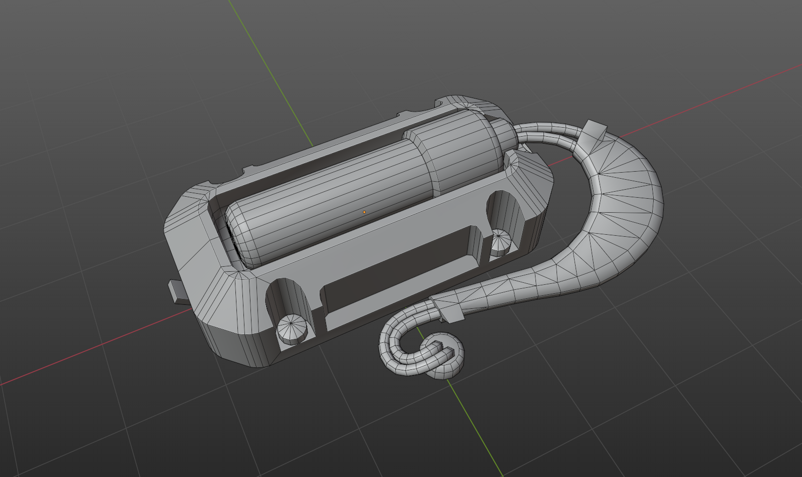
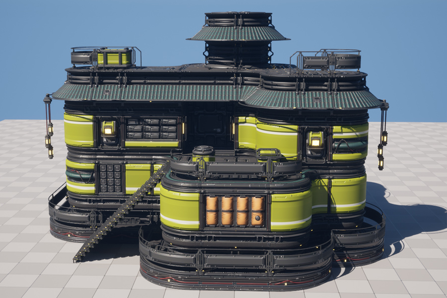

# Examples

## Tutorial

### Emergency Light
Scene from Zen UV Beginner Tutorial video.

#### Details

[//]: # (https://github.com/zen-masters/Zen-UV/raw/master/examples/ZenUV_Light_03.zip)

## Hotspot

### Bridge 1
Scene to test Hotspot Mapping operator. 
Map Islands by matching Islands to predefined Trims from Trimsheet.

[//]: # (https://github.com/zen-masters/Zen-UV/raw/master/examples/ZenUV_Hotspot_Bridge1.zip)

## Unwrap, Stack

### Generator
Scene to test Unwrap and Stack operators. 

#### Details

[//]: # (https://github.com/zen-masters/Zen-UV/raw/master/examples/ZenUV_Generator_01.zip)

## World Orient

### Fence
Scene to test World Orient operator. 
Rotate Islands the way they are oriented on the Models.

#### Details
https://user-images.githubusercontent.com/18611095/234896734-5ffa78a8-3ee6-4c9a-b5ca-de8ab8bb1544.mp4

[//]: # (https://github.com/zen-masters/Zen-UV/raw/master/examples/ZenUV_WorldOrient_Example_01.zip)

## Stack

### Amulet
Scene to test Stack operators.
Collect Similar Islands on Stacks.

#### Details
https://user-images.githubusercontent.com/18611095/234893736-e7622288-b18e-4bf2-bccf-1829ecf86533.mp4

[//]: # (https://github.com/zen-masters/Zen-UV/raw/master/examples/ZenUV_Stack_Example_01.zip)

## Trim Sheet

### Modular Sci-Fi
Modular Sci-Fi Environment Kit are made using Trim Sheet operators

#### Details

[//]: # (https://github.com/zen-masters/Zen-UV/raw/master/examples/ZenUV_SciFi_TrimSheet_01.zip)

## Addons

### Zen Bundle for Blender
All Zen add-ons in one place.
Together is cheaper!

#### Details

[comment]: # (https://www.blendermarket.com/products/zen-bundle)
