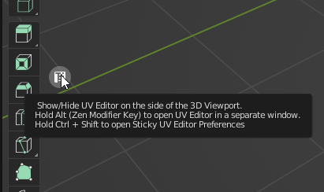
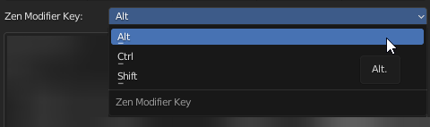

# Preferences
Can be opened in a standard way.

1. Be sure that the Zen UV add-on is already installed.
2. Go to Edit -> Preferences -> Add-ons -> Zen UV.

Another way is to LMB click on the widget [**Sticky UV Editor**](sticky_uv_editor.md), holding Ctrl+Shift keys.

## Keymap

Configure shortcuts on some important operators of the addon.

### Zen Modifier Key

The key is a modifier that is used in combination with a mouse.

Some systems, for example, [**Advanced UV Maps**](adv_uv-maps.md), involve the use of an additional key along with a click. Depending on the navigation settings, this key may not work. If this is your case, change Zen Modifier Key to a suitable one.

