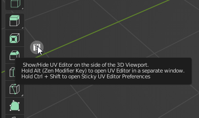
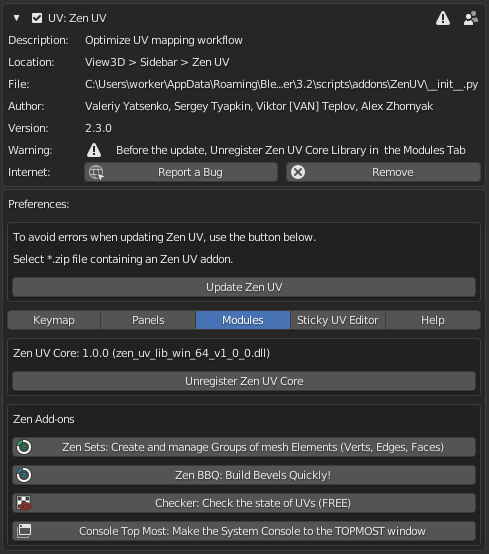
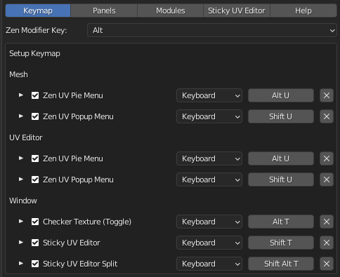
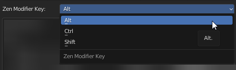

# Preferences

!!! Info
    ## ZenUV 3 Support Status

    We would like to inform you that the documentation available on this web page pertains exclusively to Zen UV 3.

    ### ZenUV 3 Support Notice
    Please be advised that active development and technical support for **ZenUV 3** have officially concluded. This version is fully compatible with Blender up to version **5.0**.

    We understand that many of you rely on ZenUV for your professional workflows, and we sincerely apologize for any inconvenience this transition may cause. While we have always strived to provide long-term value, the one-time fixed price paid for ZenUV 3 is no longer sufficient to cover the extensive amount of work required to maintain compatibility with the rapidly changing architecture of newer Blender versions. To ensure the project remains sustainable and continues to meet high standards, we must focus our resources on the next generation of the addon.

    ### Discover [ZenUV 5](https://zenmastersteam.github.io/Zen-UV/latest/)
    To take full advantage of the latest advancements in Blender and UV mapping technology, we strongly recommend upgrading to [**ZenUV 5**](https://superhivemarket.com/products/zen-uv).

Can be opened in a standard way.

1. Be sure that the Zen UV add-on is already installed.
2. Go to Edit -> Preferences -> Add-ons -> Zen UV.

Another way is to LMB click on the widget [**Sticky UV Editor**](sticky_uv_editor.md), holding Ctrl+Shift keys.

## Keymap

Configure shortcuts on some important operators of the addon.

### Zen Modifier Key

The key is a modifier that is used in combination with a mouse.

Some systems, for example, [**Advanced UV Maps**](adv_uv-maps.md), involve the use of an additional key along with a click. Depending on the navigation settings, this key may not work. If this is your case, change Zen Modifier Key to a suitable one.

