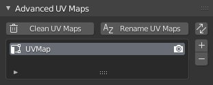
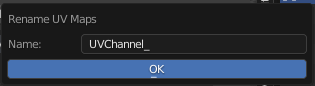
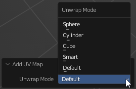
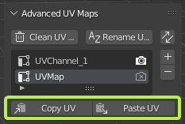

# Advanced UV Maps

!!! Info
    ## ZenUV 3 Support Status

    We would like to inform you that the documentation available on this web page pertains exclusively to Zen UV 3.

    ### ZenUV 3 Support Notice
    Please be advised that active development and technical support for **ZenUV 3** have officially concluded. This version is fully compatible with Blender up to version **5.0**.

    We understand that many of you rely on ZenUV for your professional workflows, and we sincerely apologize for any inconvenience this transition may cause. While we have always strived to provide long-term value, the one-time fixed price paid for ZenUV 3 is no longer sufficient to cover the extensive amount of work required to maintain compatibility with the rapidly changing architecture of newer Blender versions. To ensure the project remains sustainable and continues to meet high standards, we must focus our resources on the next generation of the addon.

    ### Discover [ZenUV 5](https://zenmastersteam.github.io/Zen-UV/latest/)
    To take full advantage of the latest advancements in Blender and UV mapping technology, we strongly recommend upgrading to [**ZenUV 5**](https://superhivemarket.com/products/zen-uv).

!!! Panel
    

Advanced UV Maps section created to have quick access to Object Data Properties — UV Maps.

It allows to select the active, add, remove, and rename UV Maps from the list.

If more than one object is selected, you can synchronously work with UV maps of the selected objects.

---
## Clean UV Maps
Remove inactive UV Map.

!!! tip
    Hold [Zen Modifier Key](addon_prefs.md/#zen-modifier-key) (default 'Alt') to apply on all selected objects.

---
## Rename UV Maps
Rename UV Map using pattern. The pattern can be defined in the operator popup.

   - **Name** - The pattern.
   - **Use Default Name** - Use the native name defined in Blender.
   - **Use Numbering** - Add numbers to the end of the name.
   - **Active Only** - Rename Active UV Maps only.

!!! tip
    Hold [Zen Modifier Key](addon_prefs.md/#zen-modifier-key) (default 'Alt') to apply on all selected objects.

---
## Duplicate active UV Map 
Duplicate the active UV Map or create a new one depending on the operator's properties.

!!! tip
    Hold [Zen Modifier Key](addon_prefs.md/#zen-modifier-key) (default 'Alt') to apply on all selected objects.

---
## Remove active UV Map 
Remove active UV Map.

!!! tip
    Hold [Zen Modifier Key](addon_prefs.md/#zen-modifier-key) (default 'Alt') to apply on all selected objects.

---
## Sync UV Maps IDs 
Set the same active UV Map index for all selected objects.
Alt + Click - activates automatic synchronization mode.

In automatic synchronization mode:

    If the background of the button is blue, the UVs are synchronized.

    If the background of the button is purple, the UVs are out of sync.

---

## Copy UV / Paste UV

Allows transferring the UV coordinates between UV Maps.

**Copy UV** - Copy the UV coordinates of the selection.

**Paste UV** - Paste the UV coordinates.