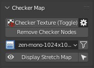
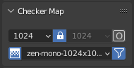
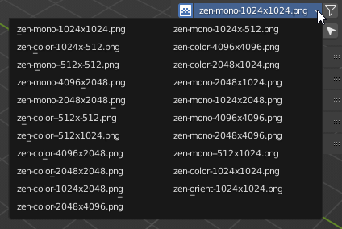
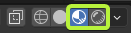
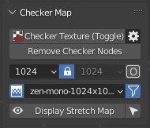
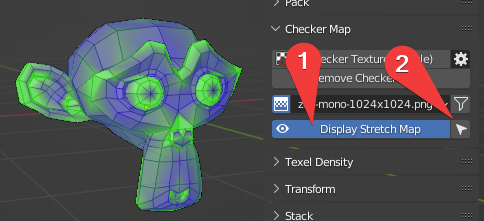

# Checker Map

!!! Panel
    

    - The panel in 3D Viewport has a full set of features.

!!! Panel
    

    - The panel in the UV Editor has a minimal set of functions. And serves only to change the checker texture. This panel is disabled by default. You can turn it on in the addon settings.

### Checker Texture (Toggle) 

Add Checker Texture to the mesh (Toggle).

!!! Preferences
    

    - **Checker Library Folder** - Checker Library Folder indicates the folder with 
    which Zen UV Checker will work.
        All textures in * .JPG, * .PNG formats that are 
        inside this folder will be collected in 
        Checker Textures list and can be used to display 
        on selected models.
    - **Reset Folder** - Reset Checker Library path to Default State.
    - **Load Your Texture** - Open File Browser and add the selected texture to the Checker Library.
    - **Refresh Texture Library** - Refresh Textures from Checker Library Folder.
    - **Auto Sync Checker** - Automatically sync selected Checker Texture with Viewport.
    - **Open Shader Editor** - Open Shader Editor with Zen UV Checker Node.
    - **Reset Checker** - Reset Zen UV Checker to Default state.

### Remove Checker Nodes

- Remove Zen UV Checker Nodes from the scene materials.

### Checker Textures Selector

#### 1. Interpolation 

- Switch texture interpolation in the Checker Node between Linear and Closest.
  

#### 2. Checker Textures

- The Checker Textures field is used to select the checker texture that will be displayed on the selected models.
- A full list of default textures.

- Any texture can be tiled or offset but only in the Material Preview or Rendered modes.

- Every texture has an bright green pixel in U = 0, V = 0 coordinates.
- If you see green faces - keep in mind that they do not have UV coordinates.
  

#### 3. Filter 

- Enable resolution fields to filter existing textures by X or/and Y resolutions.
- Includes a Lock button for filtering square format textures.
- Includes an "O" button for activating Orient Checker texture.

- Orient filtering is on.
  

### Display Stretch Map

- Display an angle-based stretching map.

  1. Toggle displaying of the stretch map.
  2. Select stretched faces.