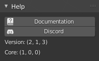

# Help

!!! Info
    We would like to inform you that the documentation available on this web page pertains exclusively to Zen UV 3. However, we would like to emphasize that [**Zen UV 4 is now available and offers a significantly improved user experience**](https://zenmastersteam.github.io/Zen-UV/latest/).

    We also remind that Zen UV 3 users can [**Upgrade Zen UV 3 to Zen UV 4 with a discount!**](https://zenmastersteam.github.io/Zen-UV/latest/zenuv3_to_zenuv4/#upgrade-zen-uv-3-to-zen-uv-4-faq)

!!! Panel
    

## [Documentation](https://zen-masters.github.io/Zen-UV/)

[Link](https://zen-masters.github.io/Zen-UV/) to the documentation of the current version.

##  [**Discord**](https://discord.gg/wGpFeME)

[Discord channel](https://discord.gg/wGpFeME) for user feedback, bug reports, and help with Zen UV.

## Version

Current version of the [Zen UV](https://www.blendermarket.com/products/zen-uv).

## Core

Current version of [Zen UV Core Library](https://sergeytyapkin.gumroad.com/l/ZenUVCore)