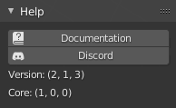

# Help

!!! Info
    ## ZenUV 3 Support Status

    We would like to inform you that the documentation available on this web page pertains exclusively to Zen UV 3.

    ### ZenUV 3 Support Notice
    Please be advised that active development and technical support for **ZenUV 3** have officially concluded. This version is fully compatible with Blender up to version **5.0**.

    We understand that many of you rely on ZenUV for your professional workflows, and we sincerely apologize for any inconvenience this transition may cause. While we have always strived to provide long-term value, the one-time fixed price paid for ZenUV 3 is no longer sufficient to cover the extensive amount of work required to maintain compatibility with the rapidly changing architecture of newer Blender versions. To ensure the project remains sustainable and continues to meet high standards, we must focus our resources on the next generation of the addon.

    ### Discover [ZenUV 5](https://zenmastersteam.github.io/Zen-UV/latest/)
    To take full advantage of the latest advancements in Blender and UV mapping technology, we strongly recommend upgrading to [**ZenUV 5**](https://superhivemarket.com/products/zen-uv).

!!! Panel
    

## [Documentation](https://zen-masters.github.io/Zen-UV/)

[Link](https://zen-masters.github.io/Zen-UV/) to the documentation of the current version.

##  [**Discord**](https://discord.gg/wGpFeME)

[Discord channel](https://discord.gg/wGpFeME) for user feedback, bug reports, and help with Zen UV.

## Version

Current version of the [Zen UV](https://www.blendermarket.com/products/zen-uv).

## Core

Current version of [Zen UV Core Library](https://sergeytyapkin.gumroad.com/l/ZenUVCore)