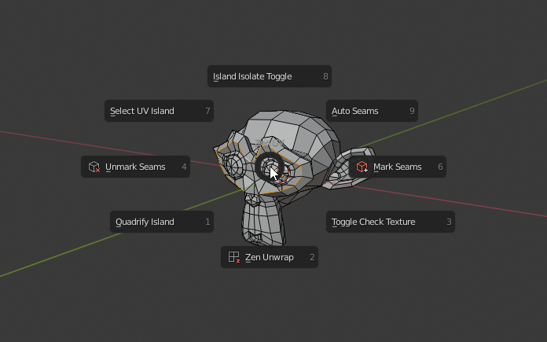

# Zen UV for Blender
Zen UV это... Главные слова почему стоит купить.
Основыные функции и преимущества.

Тут же обзорное видео. Знаю как сделать превью на всю ширину.

Картинка временная для примера.

Про три способа работы --- пай, панель, поп-ап.

<!-- blank line -->
<figure class="video_container">
  <video controls="true" allowfullscreen="true" poster="img/screen/img-001.png" width="696 px">
    <source src="img/temp/Isolate.mp4" type="video/mp4">
  </video>
</figure>
<!-- blank line -->

По сути большинству должно хватить информации с этой страницы.
Для остальных --- разделы.

- [Installation](installation)
- [Operators](operators)
- and others...