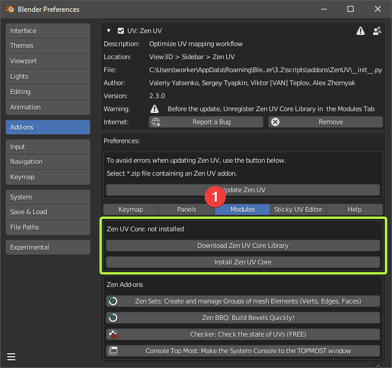

# Installation

## Zen UV
To install the addon go to **Preferences --- Addons --- Install**, then you can enable the addon by clicking on the checkbox.
  

Also, you can [**watch the video**](https://youtu.be/dqpgWcRBE4o?t=17) (with time code) how to install it.

<iframe src="https://www.youtube.com/embed/dqpgWcRBE4o?t=20" style="position: absolute; top: 0; left: 0; width: 100%; height: 100%;" allowfullscreen="" seamless="" frameborder="0"></iframe>

  

## Zen UV - Core Library

This is an additional library of the Zen UV add-on to get the fastest computations (Stack algorithm) in C++ which is impossible to be implemented in Python. It is distributed separately from the add-on as it is licensed differently from the GPL (Apache License 2.0). Zen UV Core library does not collect or send any data. It does not use any network connections: either internet or local. (Supported on Windows, Mac OS, and Linux platforms.)

### Installation

1. Be sure that the Zen UV add-on is already installed.
2. Go to Edit -> Preferences -> Add-ons -> Zen UV.
3. Go to Modules.
4. Press  Install Zen UV Core.
5. Select the zen_uv_lib file in the Blender File View Window.
6. Press  Install Zen UV Core
7. Done!

