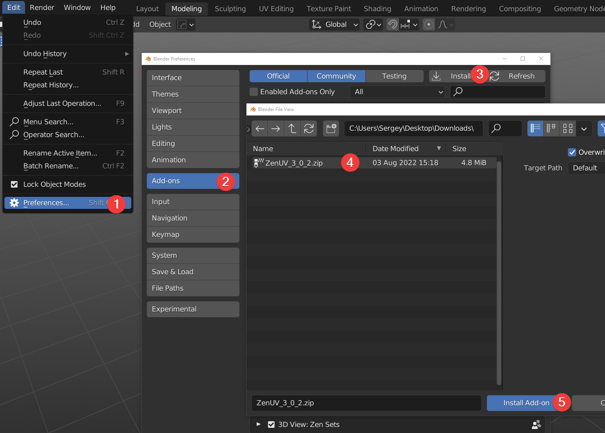
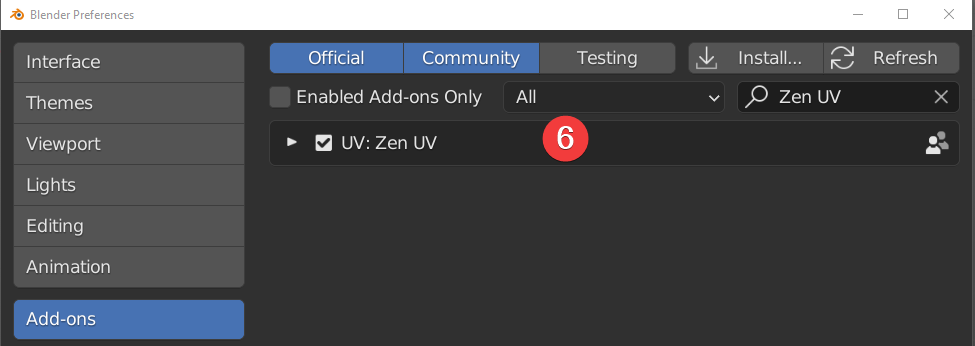
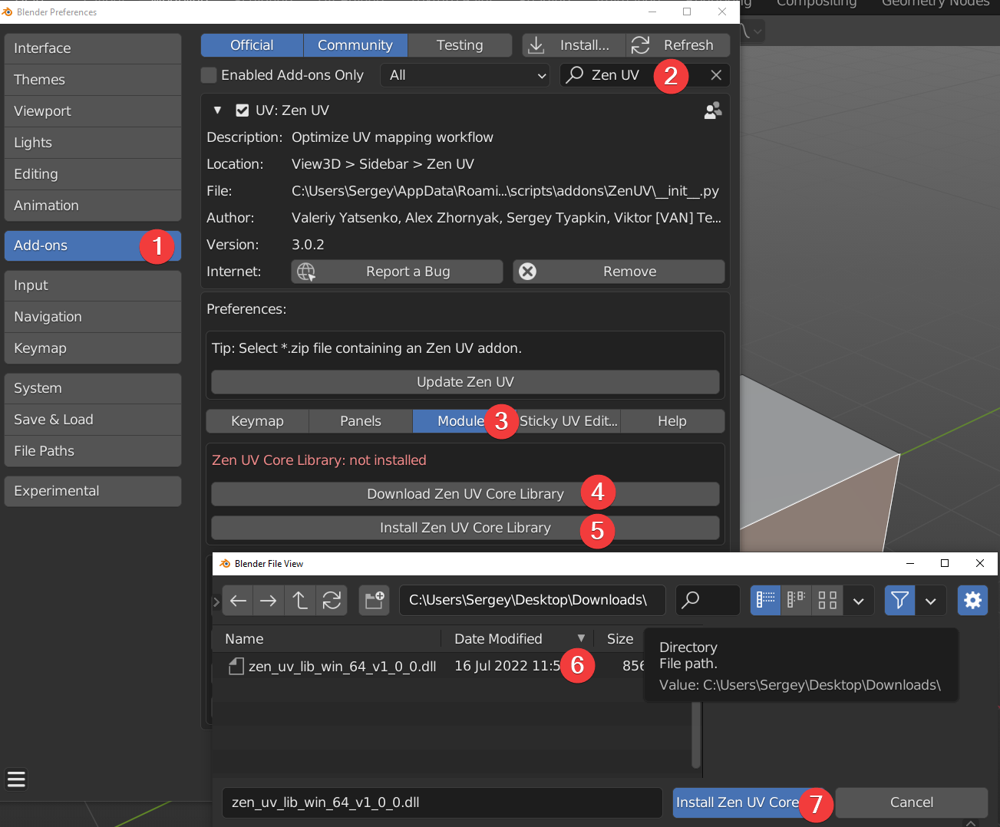
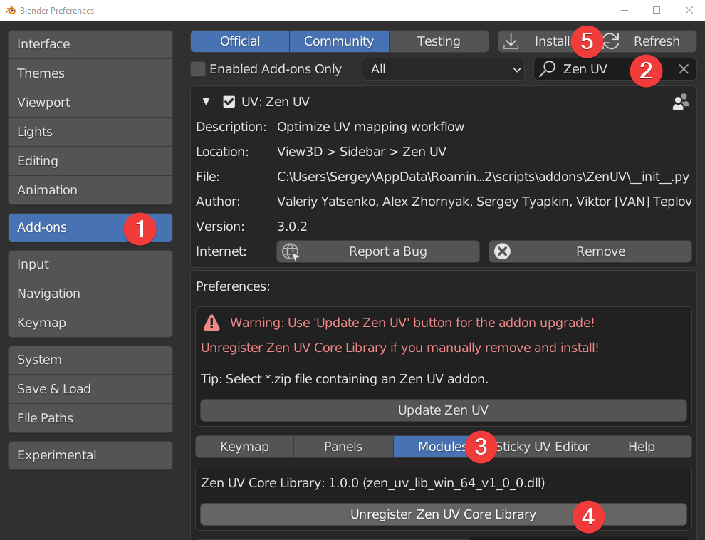
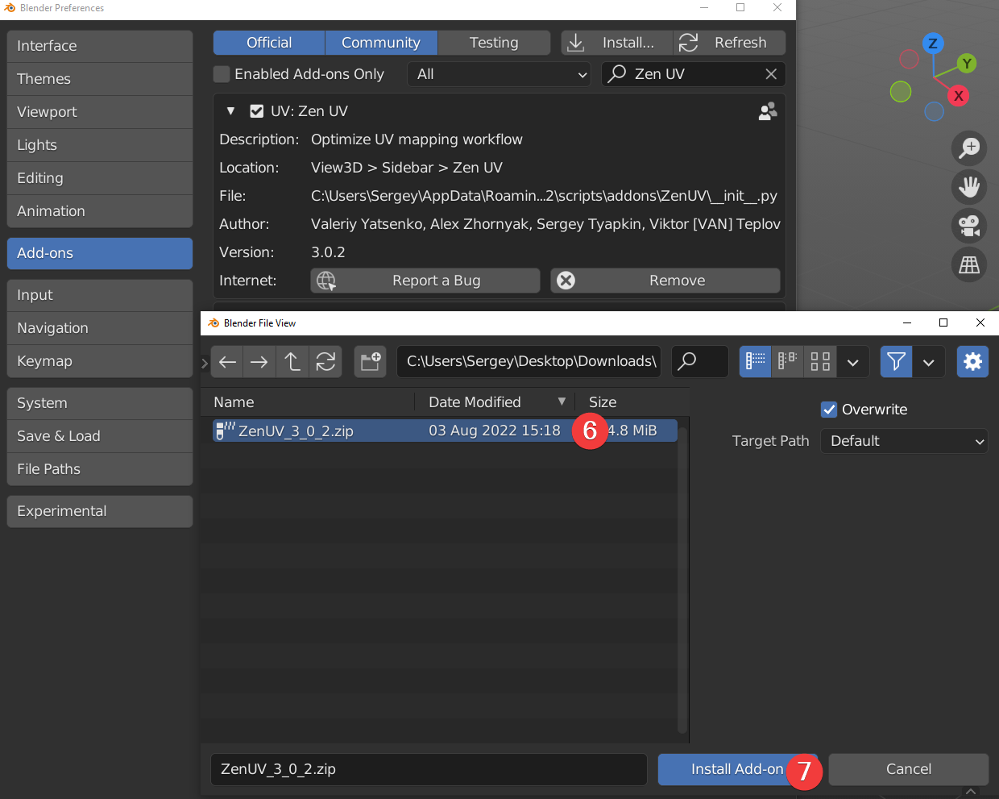

# Installation and update

## Installation

1. Go to **Edit** -> **Preferences**.
2. Go to **Add-ons**.
3. Press **Install**.
4. Select Zen UV.zip.
5. Press **Install Add-on**.
6. Enable Zen UV add-on using checkbox and restart Blender. 
7. Done! Let's go further and [**install Zen UV Core Library**](https://zen-masters.github.io/Zen-UV/installation/#zen-uv-core-library-installation) to enable [**Stack**](https://zen-masters.github.io/Zen-UV/stack/#stack) feature!  

## Zen UV Core Library Installation

!!! Library
    Zen UV Core library is an additional library of the Zen UV add-on to get the fastest computations ([Stack](https://zen-masters.github.io/Zen-UV/stack/#stack) algorithm) in C++ which is impossible to be implemented in Python. It is distributed separately from the add-on as it is licensed differently from the GPL (Apache License 2.0). Zen UV Core library does not collect or send any data. It does not use any network connections: either internet or local. It is supported on Windows, Mac OS 11 (M1 CPU Universal app only), and Linux platforms.

1. Go to **Preferences** -> **Add-ons**.
2. Find installed and enabled Zen UV add-on.
3. Go to **Modules**.
4. Press [**Download Zen UV Core Library (FREE)**](https://gumroad.com/l/ZenUVCore) if you don't have it.
5. Press **Install Zen UV Core Library**.
6. Select Zen UV Core Library file.
7. Press **Install Zen UV Core Library**.
8. Done! Now the add-on is fully installed and you can use all the features!

## Update

1. Go to **Preferences** -> **Add-ons**.
2. Find installed and enabled Zen UV add-on.
3. Press **Update Zen UV**.
4. Select new version Zen UV.zip.
5. Press **Update Zen UV** and restart Blender.
6. [**Install Zen UV Core Library**](https://zen-masters.github.io/Zen-UV/installation/#zen-uv-core-library-installation).
7. Done!

### Manual Update

!!! Manual
    Use this update method if for some reason you need to update the add-on using Blender's standard method. In all other cases, we recommend using [**Zen UV Update**](https://zen-masters.github.io/Zen-UV/installation/#update). 
    
1. Go to **Preferences** -> **Add-ons**.
2. Find installed and enabled Zen UV add-on.
3. Go to **Modules**.
4. Press **Unregister Zen UV Core Libary**.
5. Press **Install**.
6. Select new version Zen UV.zip.
7. Press **Install Add-on** and restart Blender.
8. [**Install Zen UV Core Library**](https://zen-masters.github.io/Zen-UV/installation/#zen-uv-core-library-installation).
9. Done!

### Still have problems with update?

1. Go to Blender add-ons folder. (C:\Users\Sergey\AppData\Roaming\Blender Foundation\Blender\3.2\scripts\addons).
2. Delete Zen UV folder manually.
3. [**Install Zen UV add-on**](https://zen-masters.github.io/Zen-UV/installation/#installation).
4. Done!