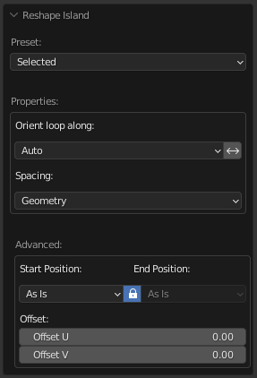
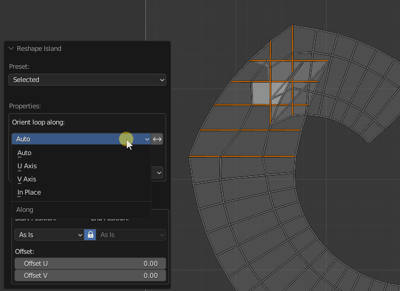
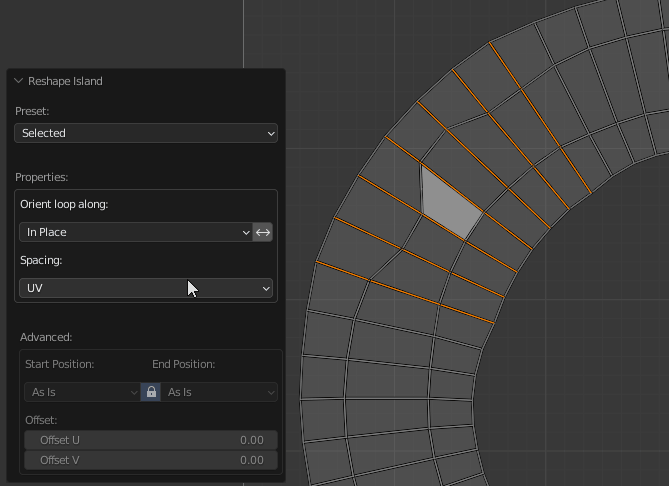
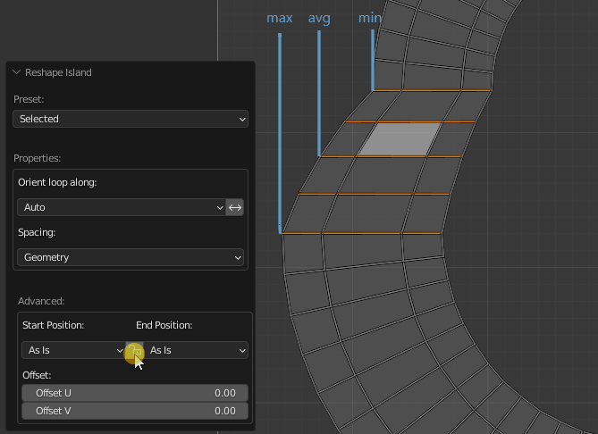
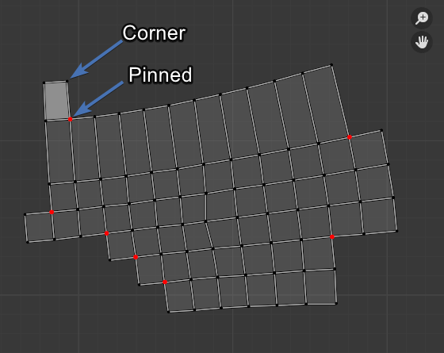
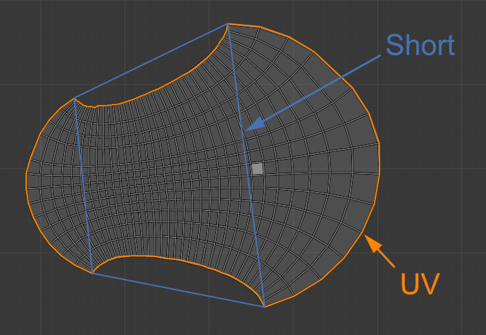
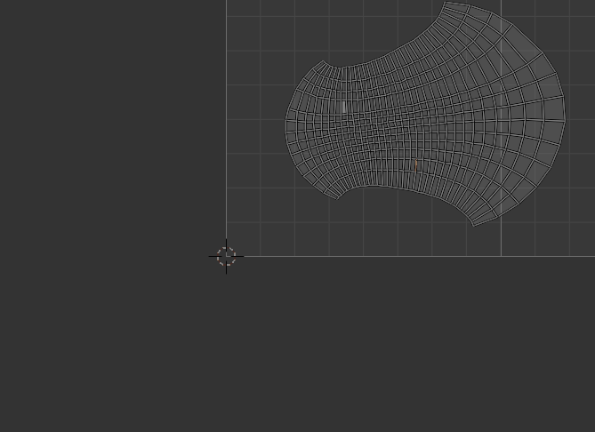

# Reshape Island

Changes the island’s shape depending on the preset.

## Preset Selected:

- Straighten the selected Edge Loops and relax not selected vertices.
  
  

!!! Properties
    - **Orient loop along** - How to orient the selected loops.
        - **Auto** - Automatic finding loop orientation.
        - **U Axis** - Along the U axis.
        - **V Axis** - Along the V axis.
        - **In Place** - The beginning and end of the loop will remain such as before the operator runs.
    - **Reverse Direction** - Change the direction of the loop to the opposite.
    - **Spacing** - How to set the distances between the points of the loop.
        - **UV** - As in the UV Map.
        - **Geometry** - As in the mesh.
        - **Evenly** - Distribute at an equal distance.

### Orient Along Sample:

 

### Spacing Sample:

 

## Advanced Properties:

 - The properties of the operator for aligning the loops relative to each other.

!!! Properties
    - **Start Position:** - How to set the beginning of the loop.
        - **As is** - Leave in place.
        - **Max** - Set to the maximal position of the loops.
        - **Averaged** - Set to the averaged position of the loops.
        - **Min** - Set to the minimal position of the loops.
    - **Lock** - Lock Start Position and the End Position.
    - **End Position:** - How to set the ending of the loop.
        - **As is** - Leave in place.
        - **Max** - Set to the maximal position of the loops.
        - **Averaged** - Set to the averaged position of the loops.
        - **Min** - Set to the minimal position of the loops.
    - **Offset** - Indicates the offset of each next loop relative to the previous. Sorting begins on the left bottom. The red color indicates that the value is not zero.

### Start / End Position Sample:

  

### Offset Sample:

  

---
## Preset U/V Direction:

!!! Properties
    - **Angle** - If the slope of the edge is less or equal to this value, then the edge will be selected.
    - **Spacing** - How to set the distances between the points of the loop.

  

 Please refer to the [Advanced Properties](#advanced-properties) to learn more.
 
 How to work Angle value:

 

  - If **angle 01** is less than **angle 02** means the edge is aligned along the U axis. If opposite, then the edge is aligned along the V axis.
  - If the value ​​of the **Angle:** operator’s properties are less than **angle 01**, then the edge will not be selected.

## Preset Borders:

!!! Properties
  - **Corners By:** - How to detect corners of the Island.
      - **Corner** - By corner vertices.
      - **Pinned** - By pinned vertices.
      - **Pinned & Corners** - By pinned and corner vertices.
  - **Length** - How to calculate the length for each straightened border segment.
      - **UV** - As a sum of UV edges length.
      - **Geometry** - As a sum of mesh edge length.
      - **Short** - As a distance from the first point to the last point of the edge loop.
  - **Border Offset** - Offset all the vertices use the first point as a pivot. This leads to island scaling.
  
### Corner Sample:

  

  - A Corner Point - it's a point that has 2 connected edges.
  - Pinned Point - it's a point that is pinned by Blender's native Pin operator.

### Length Sample:

  

  