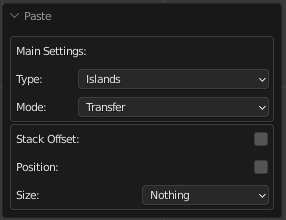
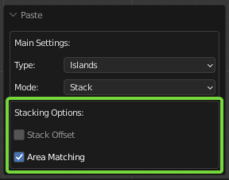
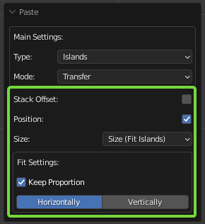
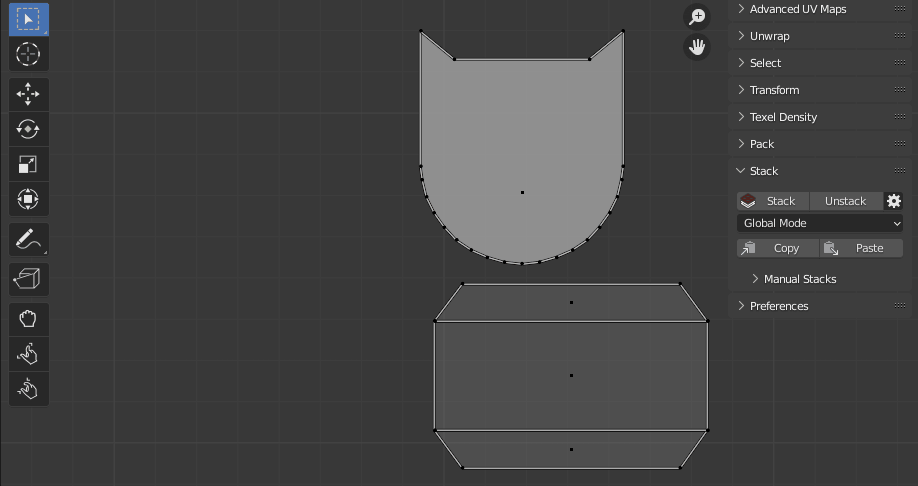

# Copy / Paste (Stacks)

Allows you to transfer the parameters from one island to another.

---
## Copy

 - Copy parameters of selected Islands/Faces and save them.

### Copy Operator Options

- **Island** - Copy and save parameters from the selected island.
- **Faces** - Copy and save parameters from the selected faces.

---
## Paste

 - Paste the parameters saved earlier by [Copy](#copy) to selected Islands/Faces.

### Paste Operator Options

- **Type** - Which selection type needs to be processing.
    - **Island** - Paste parameters to the selected island.
    - **Faces** - Paste parameters to the selected faces.

- **Mode** - 
    - **Stack** - Perform stacking selection to the copied by [Copy](#copy).
    - **Transfer** - Transfer paramethers to the selection stored by [Copy](#copy).

#### Stacking Options:

- **Stack Offset** - Use the Stack Offset option. Learn More in this article: [Stack](../stack.md#stack)
- **Area Matching** - Set strict requirements for Islands Area Matching when Stacking. Disable this option if the Islands have a slightly different Area.

#### Transfer Options:

- **Stack Offset** - Use the Stack Offset option. Learn More in this article: [Stack](../stack.md#stack)
- **Position** - Allow transfer position.
- **Size** - Allow transfer size.
    - **Nothing** - Do not perform the size transferring.
    - **Size (Fit Islands)** - Transfer the size.
        - **Keep Proportion** - Keep the proportion of the selected island.
        - **Horizontally / Vertically** - Which direction needs to be matched.
    - **Texel Density** - Transfer the Texel Density.

---
## Usage Samples.

### Paste: Mode - Stack.

### Paste: Mode - Transfer - Position.

### Paste: Mode - Transfer - Size - Fit.

