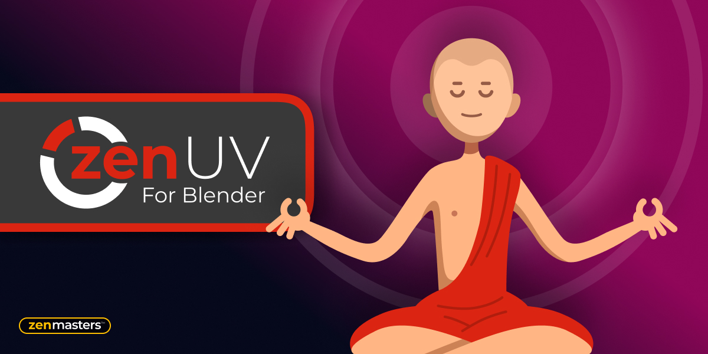

# Our Add-ons

!!! Info
    We would like to inform you that the documentation available on this web page pertains exclusively to Zen UV 3. However, we would like to emphasize that [**Zen UV 4 is now available and offers a significantly improved user experience**](https://zenmastersteam.github.io/Zen-UV/latest/).

    We also remind that Zen UV 3 users can [**Upgrade Zen UV 3 to Zen UV 4 with a discount!**](https://zenmastersteam.github.io/Zen-UV/latest/zenuv3_to_zenuv4/#upgrade-zen-uv-3-to-zen-uv-4-faq)

## Zen Bundle

All Zen add-ons in one place. Together is cheaper!

  [**Blender Market**](https://www.blendermarket.com/products/zen-bundle)      [**Gumroad**](https://sergeytyapkin.gumroad.com/l/ZenBundle)

---

## Zen UV

Zen UV is not just a set of tools, it is ready to use pipeline for fast creating UV’s in Blender.
It represents an intuitive system created by professionals and refined in real projects. Enjoy this experience with us!

  [**Blender Market**](https://www.blendermarket.com/products/zen-uv)      [**Gumroad**](https://gumroad.com/l/ZenUV4)

[**Zen UV Documentation**](https://zen-masters.github.io/Zen-UV/)

---

## Zen Sets

Zen Sets is an add-on for creating, managing, and visualizing Collections and Mesh Element Groups. Save the selection of Verts / Edges / Faces / Objects to bring it back whenever you want, modify it, and display it by color in Viewport and UV Editor in a couple of clicks. Meet true Selection Sets for Blender!

  [**Blender Market**](https://www.blendermarket.com/products/zen-sets)      [**Gumroad**](https://gumroad.com/l/ZenSets)

[**Zen Sets Documentation**](https://zen-masters.github.io/Zen-Sets/)

---

## Zen BBQ

Zen BBQ is an add-on for creating, adjusting, and visualizing Bevels in a couple of clicks! Are you tired of preparing geometry for the Subd or Bevel modifiers? Look no further! 

  [**Blender Market**](https://www.blendermarket.com/products/zen-bbq)      [**Gumroad**](https://gumroad.com/l/ZenBBQ)

[**Zen BBQ Documentation**](https://zen-masters.github.io/Zen-BBQ/)

---

## Checker

Check the state of UVs (FREE).

  [**Blender Market**](https://www.blendermarket.com/products/checker)      [**Gumroad**](https://gumroad.com/l/zenuv_checker)

[**Checker Documentation**](https://zen-masters.github.io/Zen-UV/checker/ )

---

## Console Top Most

Are you tired of switching back to the System Console window in Blender? There is a way out!
Console Top Most add-on makes the System Console to the TOPMOST window!

  [**Blender Market**](https://www.blendermarket.com/products/zen-console-top-most-for-blender)      [**Gumroad**](https://gumroad.com/l/ZenConsoleTopMost)

