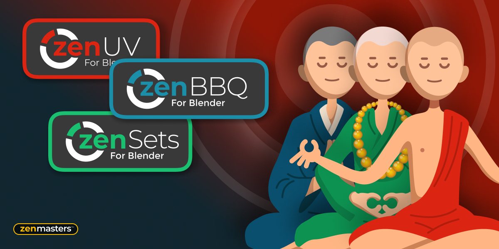
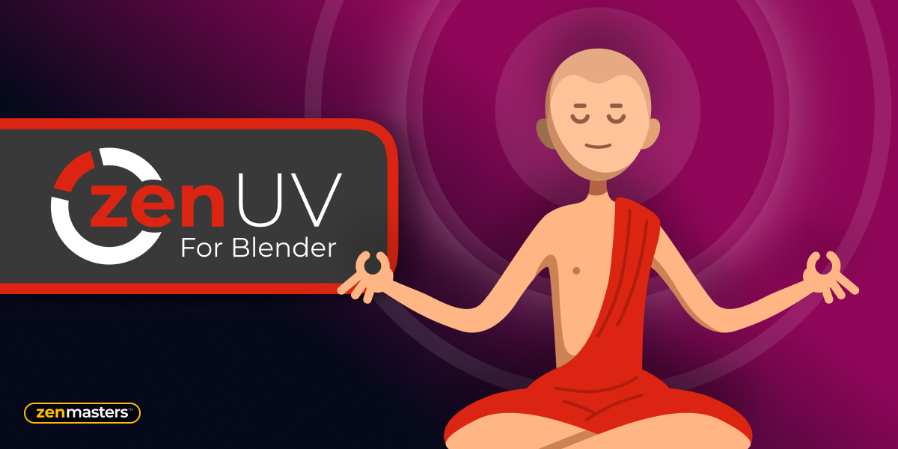
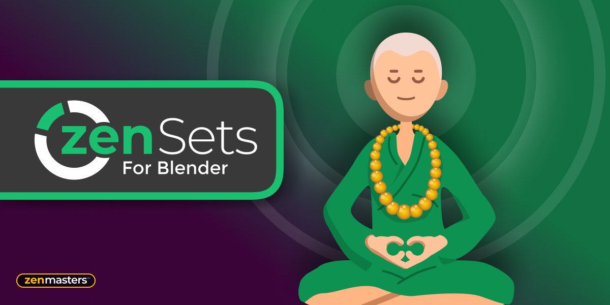
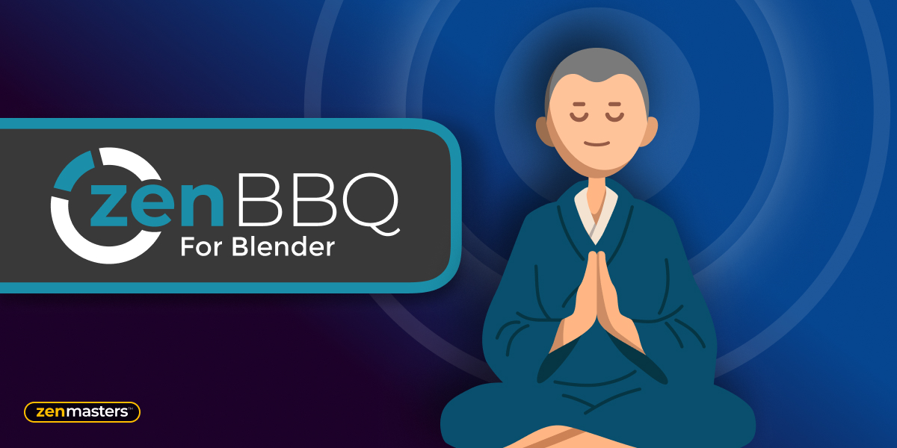
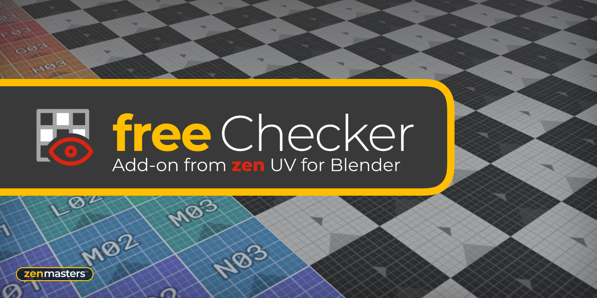
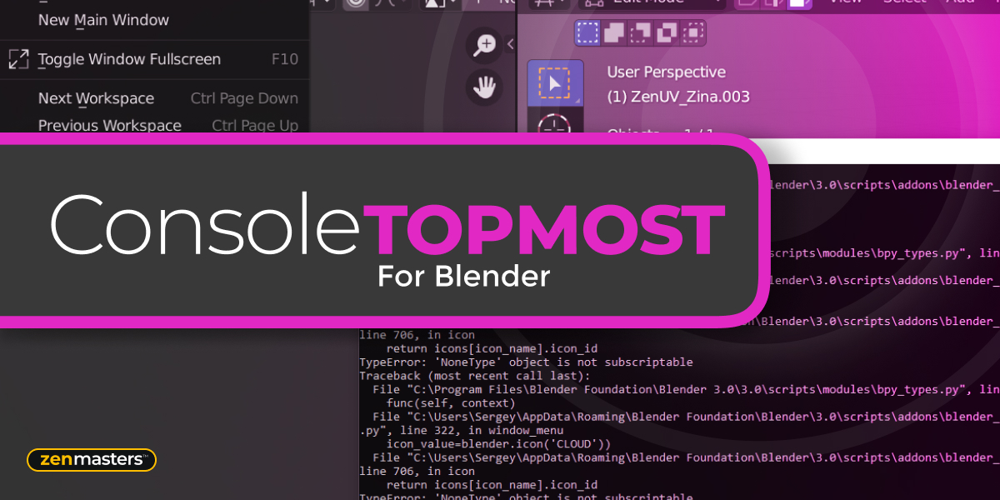

# Our Add-ons

!!! Info
    ## ZenUV 3 Support Status

    We would like to inform you that the documentation available on this web page pertains exclusively to Zen UV 3.

    ### ZenUV 3 Support Notice
    Please be advised that active development and technical support for **ZenUV 3** have officially concluded. This version is fully compatible with Blender up to version **5.0**.

    We understand that many of you rely on ZenUV for your professional workflows, and we sincerely apologize for any inconvenience this transition may cause. While we have always strived to provide long-term value, the one-time fixed price paid for ZenUV 3 is no longer sufficient to cover the extensive amount of work required to maintain compatibility with the rapidly changing architecture of newer Blender versions. To ensure the project remains sustainable and continues to meet high standards, we must focus our resources on the next generation of the addon.

    ### Discover [ZenUV 5](https://zenmastersteam.github.io/Zen-UV/latest/)
    To take full advantage of the latest advancements in Blender and UV mapping technology, we strongly recommend upgrading to [**ZenUV 5**](https://superhivemarket.com/products/zen-uv).

## Zen Bundle

All Zen add-ons in one place. Together is cheaper!

  [**Blender Market**](https://www.blendermarket.com/products/zen-bundle)      [**Gumroad**](https://sergeytyapkin.gumroad.com/l/ZenBundle)

---

## Zen UV

Zen UV is not just a set of tools, it is ready to use pipeline for fast creating UV’s in Blender.
It represents an intuitive system created by professionals and refined in real projects. Enjoy this experience with us!

  [**Blender Market**](https://www.blendermarket.com/products/zen-uv)      [**Gumroad**](https://gumroad.com/l/ZenUV4)

[**Zen UV Documentation**](https://zen-masters.github.io/Zen-UV/)

---

## Zen Sets

Zen Sets is an add-on for creating, managing, and visualizing Collections and Mesh Element Groups. Save the selection of Verts / Edges / Faces / Objects to bring it back whenever you want, modify it, and display it by color in Viewport and UV Editor in a couple of clicks. Meet true Selection Sets for Blender!

  [**Blender Market**](https://www.blendermarket.com/products/zen-sets)      [**Gumroad**](https://gumroad.com/l/ZenSets)

[**Zen Sets Documentation**](https://zen-masters.github.io/Zen-Sets/)

---

## Zen BBQ

Zen BBQ is an add-on for creating, adjusting, and visualizing Bevels in a couple of clicks! Are you tired of preparing geometry for the Subd or Bevel modifiers? Look no further! 

  [**Blender Market**](https://www.blendermarket.com/products/zen-bbq)      [**Gumroad**](https://gumroad.com/l/ZenBBQ)

[**Zen BBQ Documentation**](https://zen-masters.github.io/Zen-BBQ/)

---

## Checker

Check the state of UVs (FREE).

  [**Blender Market**](https://www.blendermarket.com/products/checker)      [**Gumroad**](https://gumroad.com/l/zenuv_checker)

[**Checker Documentation**](https://zen-masters.github.io/Zen-UV/checker/ )

---

## Console Top Most

Are you tired of switching back to the System Console window in Blender? There is a way out!
Console Top Most add-on makes the System Console to the TOPMOST window!

  [**Blender Market**](https://www.blendermarket.com/products/zen-console-top-most-for-blender)      [**Gumroad**](https://gumroad.com/l/ZenConsoleTopMost)

