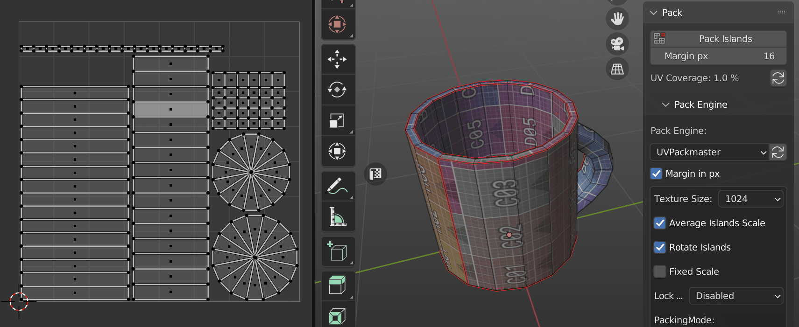
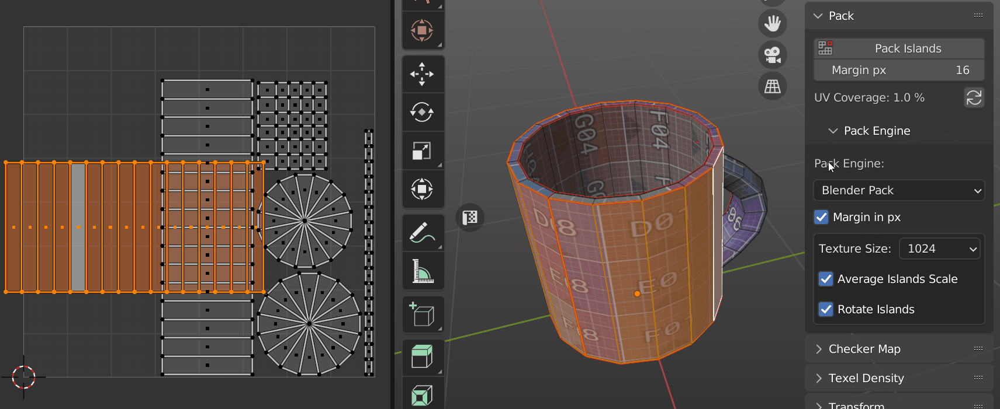
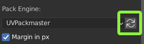

# Pack
!!! Panel
    

### Pack Islands

Pack all Islands using selected [**Pack Engine**](https://zen-masters.github.io/Zen-UV/pack/#pack-engine).

### Margin

Set space between Islands for Pack Islands operation. 

!!! tip
    It's important to have enough space (Margin) between UV Islands to avoid visual artefacts  connected with texture filtering in game engine renders.

    Here are suggested Margin values to use for different size textures:

    - 256 - 2px
    - 512 - 4px
    - 1024 - 8px
    - 2048 - 16px
    - 4096 - 32px
    - 8192 - 64px
  
### UV Coverage

Calculate Islands UV Coverage for active UV map. Increasing UV Coverage value leads to the increasing [Texel Density](https://zen-masters.github.io/Zen-UV/texel_density/) value, this in turn leads to the more efficient UV space usage and you can see more pixels on your model using the same texture.

!!! tip
    To increase UV Coverage value and achieve efficient UV space usage (80-90% of UV Coverage):

    - Cut big Islands into smaller pieces if you have too much empty space. 
    - Upscale small objects on UV map to fill empty space.
    - Downscale UV Islands that are barely visible on the model (e.g. bottom, back parts, etc.).
    - Use UVPackmaster Pack Engine with enabled Heuristic option.

## Pack Engine

!!! Panel
    

### Supported Pack Engines
Zen UV supports three Pack engines:

- **Blender Pack**
- [**UV Packmaster 2, 3**](https://uvpackmaster.com)
- [**UV Packer**](https://www.uv-packer.com/)

### Pack Engine Preferences

The main preferences of each Pack Engine are placed in Zen UV interface. To use all the preferences please go to the main interface of the engine (UV Packer, UV Packmaster). 

Below we described General preferences for all Pack Engines. If you want to obtain information about Specific preferences for some engine, please refer to the documentation of the corresponding engine.

#### Texture Size

Texture Size preset, works in pair with [**Margin**](https://zen-masters.github.io/Zen-UV/pack/#margin).

#### Average Islands Scale

Average Islands Scale before Pack Islands operation.

#### Rotate Islands

Allow Pack Engine rotate Islands.

!!! tip
    **UV Packmaster Pack Engine** has super useful option **Lock Overlapping.** It's recommended to be used to Pack Stacked and Overlapping Islands. If you don't have UV Packmaster installed, but still want to Pack Stacked and Overlapping Islands [**watch this video**](https://youtu.be/krsVbEi32DM).

!!! tip
    If you want to use specific **UV Packmaster Pack Engine** features that are not present in Zen UV interface do not forget to transfer existing settings using this **Transfer settings** button.

    

    Then you can open **UV Packmaster** interface and complete the setup.