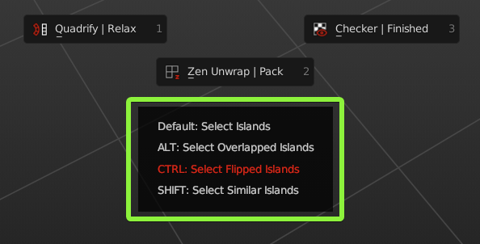

# Pie Menu

## Operators

### Quadrify | Relax 

- `Default` — [**Quadrify Islands**](https://zen-masters.github.io/Zen-UV/transform/#quadrify-islands). Straighten rectangular-shaped Islands.
- `CTRL` — [**Relax**](https://zen-masters.github.io/Zen-UV/transform/#relax). Relax Selected Islands.
  
### Zen Unwrap | Pack 

- `Default` — [**Zen Unwrap**](https://zen-masters.github.io/Zen-UV/unwrap/#zen-unwrap). Unwrap by Marked edges. If you have selected edges or faces they will be Marked as Seams and/or Sharp Edges and Unwrapped after.
- `ALT` — [**Pack Islands**](https://zen-masters.github.io/Zen-UV/pack/#pack-islands). Pack Islands by chosen Pack Engine.

### Checker | Finished 

- `Default` — [**Checker Texture (Toggle)**](https://zen-masters.github.io/Zen-UV/checker/#checker-texture-toggle). Add/Remove Checker Texture to/from the mesh.
- `ALT` — [**Display Stretch Map**](https://zen-masters.github.io/Zen-UV/checker/#display-stretch-map). Display an angle-based stretching map.
- `CTRL` — [**Display Finished**](https://zen-masters.github.io/Zen-UV/unwrap/#display-finished-toggle). Display Finished Islands (Toggle).

### Unmark | Tag Unfinished 

- `Default` — [**Unmark**](https://zen-masters.github.io/Zen-UV/unwrap/#unmark). Unmark selected edges or face borders as Seams and/or Sharp edges.
- `ALT` — [**Unmark All**](https://zen-masters.github.io/Zen-UV/unwrap/#unmark-all). Remove all Seams and/or Sharp edges from the mesh.
- `CTRL` — [**Tag Unfinished**](https://zen-masters.github.io/Zen-UV/unwrap/#tag-unfinished). Tag selected Islands as Unfinished.

### Mark | Tag Finished 

- `Default` — [**Mark**](https://zen-masters.github.io/Zen-UV/unwrap/#mark). Mark selected edges or face borders as Seams and/or Sharp edges.
- `CTRL` — [**Tag Finished**](https://zen-masters.github.io/Zen-UV/unwrap/#tag-finished). Tag selected Islands as Finished. Islands Taged as Finished won't be unwrapped, recommended to Tag manually changed Islands (e.g. Quadrified Islands).

### Select: Islands | Overlapped 

- `Default` — [**Select Islands**](https://zen-masters.github.io/Zen-UV/select/#islands). Select Islands by selected edge/face of the Islands.
- `ALT` — [**Select Overlapped Islands**](https://zen-masters.github.io/Zen-UV/select/#overlapped).
- `CTRL` — [**Select Flipped Islands**](https://zen-masters.github.io/Zen-UV/select/#flipped).
- `SHIFT` — [**Select Similar Islands**](https://zen-masters.github.io/Zen-UV/select/#similar).

### Isolate Islands (Toggle)

- `Default` — [**Isolate Islands (Toggle)**](https://zen-masters.github.io/Zen-UV/select/#isolate-islands-toggle). Isolate Islands by selected edge/face of the Islands.

### Mark by Angle

- `Default` — [**Mark by Angle**](https://zen-masters.github.io/Zen-UV/unwrap/#mark-by-angle). Mark edges as Seams and/or Sharp edges by Angle.

---
## Pie Menu Assist

Pie Menu Assist is special help window, which is located below the Pie Menu. There you can find, highlight and execute all the alternative `ALT`, `CTRL`, `SHIFT` Pie Menu commands.

!!! Assist
    If you want to disable Pie Menu Assist, you can do it here **N-Panel** -> **Zen UV** -> **Preferences** -> **Display** -> **Display Pie Assist**. 

## Default Shortcut
  Zen UV Pie Menu  --- `Alt + U`

!!! Shortcut
    If you don't like default Pie Menu Shortcut, it can be changed here **Edit** -> **Preferences** -> **Add-ons** -> **Zen UV** -> **Keymap**. Don't forget to change Shortcut for both contexts Mesh and UV Editor.