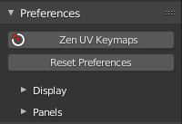
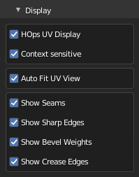
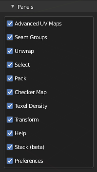

# Preferences System

!!! Info
    ## ZenUV 3 Support Status

    We would like to inform you that the documentation available on this web page pertains exclusively to Zen UV 3.

    ### ZenUV 3 Support Notice
    Please be advised that active development and technical support for **ZenUV 3** have officially concluded. This version is fully compatible with Blender up to version **5.0**.

    We understand that many of you rely on ZenUV for your professional workflows, and we sincerely apologize for any inconvenience this transition may cause. While we have always strived to provide long-term value, the one-time fixed price paid for ZenUV 3 is no longer sufficient to cover the extensive amount of work required to maintain compatibility with the rapidly changing architecture of newer Blender versions. To ensure the project remains sustainable and continues to meet high standards, we must focus our resources on the next generation of the addon.

    ### Discover [ZenUV 5](https://zenmastersteam.github.io/Zen-UV/latest/)
    To take full advantage of the latest advancements in Blender and UV mapping technology, we strongly recommend upgrading to [**ZenUV 5**](https://superhivemarket.com/products/zen-uv).

---

## Preferences subpanel
!!! Panel
    

 -  **Zen UV Keymaps** - Set Shortcuts for Zen UV Menus.
 - **Reset Preferences** - Reset Zen UV preferences to the Default state.

---

## Display subpanel

 - **HOps UV Display** - Display UV in 3D View using Hard Ops addon.
 - **Context-sensitive** - Enable HOps UV Display if UV Editor is open.
 - **Auto Fit UV View** - Automatically Fit and Zoom UV viewport.
 - **Show Seams** - Display UV Seams.
 - **Show Sharp Edges** - Display Sharp edges. It can be overlapped by Seams/Bevel Weights/Crease Edges display.
 - **Show Bevel Weights** - Display Sharp edges. It can be overlapped by Seams/Bevel Weights/Crease Edges display.
 - **Show Crease Edges** - Display crease edges created for the Subdivision modifier. It can be overlapped by Seams/Bevel Weights display.

---

## Panels subpanel

Allow disabling displaying unused categories.