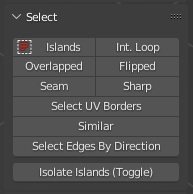
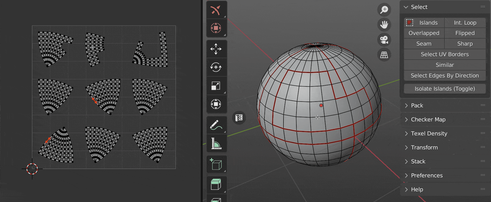
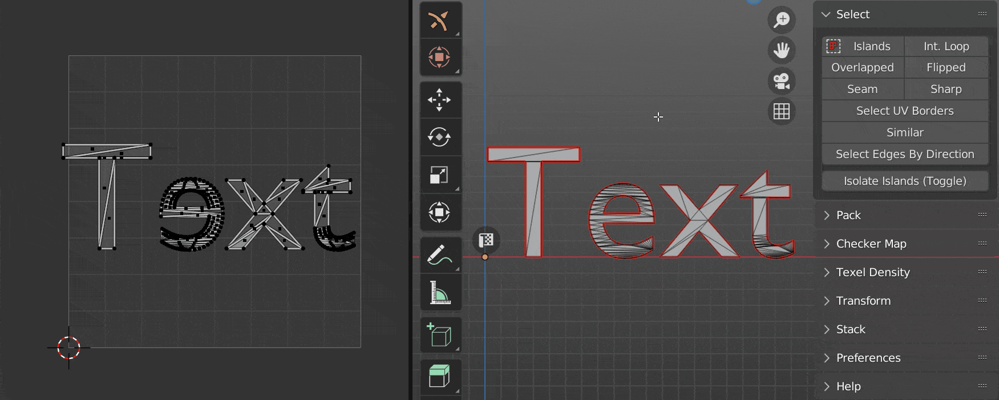
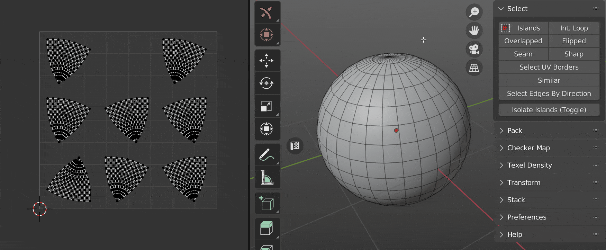
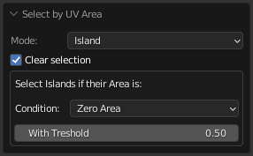
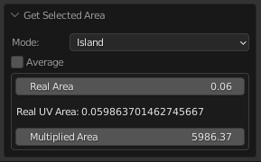
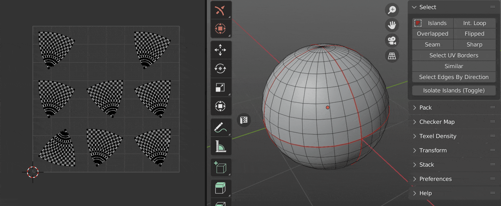

# Select

!!! Info
    We would like to inform you that the documentation available on this web page pertains exclusively to Zen UV 3. However, we would like to emphasize that [**Zen UV 4 is now available and offers a significantly improved user experience**](https://zenmastersteam.github.io/Zen-UV/latest/).

    We also remind that Zen UV 3 users can [**Upgrade Zen UV 3 to Zen UV 4 with a discount!**](https://zenmastersteam.github.io/Zen-UV/latest/zenuv3_to_zenuv4/#upgrade-zen-uv-3-to-zen-uv-4-faq)

!!! Panel
    

---
### Islands 

- Select Islands by selected edge/face of the Islands.

---
### Int. Loop

- Inter seam loop. Select Edge Loop with respect to Seams. 

---
### Overlapped

- Select Overlapped Islands.

---
### Flipped

- Select Flipped Islands.

---
### Seam

- Select Edges Marked as Seams.

---
### Sharp

- Select Edges Marked as Sharp.

---
### Select UV Borders

- Select existing UV Borders.

---
### Similar

- Select Islands similar to those selected.

  
---
### Select Edges By Direction

- Select edges by direction along U or V axis.

---
### Select by UV Area

- The operator consists of two buttons. Where the first is the main operator and the second is an auxiliary operator. You can use it to get the area of the selection.

---
#### Operator Select by UV Area:

  - **Mode** - What should be selected? Islands or faces.
  - **Clear selection** - Clear the previous selection.
  - **Condition** - The conditions under which the selection will be made.
    - **Zero Area** - Elements with zero area value.
    - **Within range** - Elements, the area of which is within a specified range.
    - **More than** - Elements with an area greater than the specified value.
    - **Equal to** - Elements, the area of which is equal to a specified value.
    - **Less than** - Elements with an area smaller than the specified value.
  - **With Threshold** - Calculation threshold.

#### Operator Get Selected Area:

- After you run this operator, the Multiplied Area value goes into the Select by UV Area operator.

  - **Mode** - The area of what should be obtained? Islands or faces.
  - **Average** - Averaging.
  - **Real Area** - The area within the UV Editor is very small. This value shows the real area.
  - **Real UV Area** - Same value as Real Area, but in full size.
  - **Multiplied Area** - The same value as the Real Area, but multiplied for easier use.

---
### Isolate Islands (Toggle)

- Isolate Islands (Toggle).

