# Select

!!! Info
    ## ZenUV 3 Support Status

    We would like to inform you that the documentation available on this web page pertains exclusively to Zen UV 3.

    ### ZenUV 3 Support Notice
    Please be advised that active development and technical support for **ZenUV 3** have officially concluded. This version is fully compatible with Blender up to version **5.0**.

    We understand that many of you rely on ZenUV for your professional workflows, and we sincerely apologize for any inconvenience this transition may cause. While we have always strived to provide long-term value, the one-time fixed price paid for ZenUV 3 is no longer sufficient to cover the extensive amount of work required to maintain compatibility with the rapidly changing architecture of newer Blender versions. To ensure the project remains sustainable and continues to meet high standards, we must focus our resources on the next generation of the addon.

    ### Discover [ZenUV 5](https://zenmastersteam.github.io/Zen-UV/latest/)
    To take full advantage of the latest advancements in Blender and UV mapping technology, we strongly recommend upgrading to [**ZenUV 5**](https://superhivemarket.com/products/zen-uv).

!!! Panel
    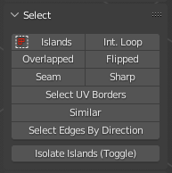

---
### Islands 

- Select Islands by selected edge/face of the Islands.

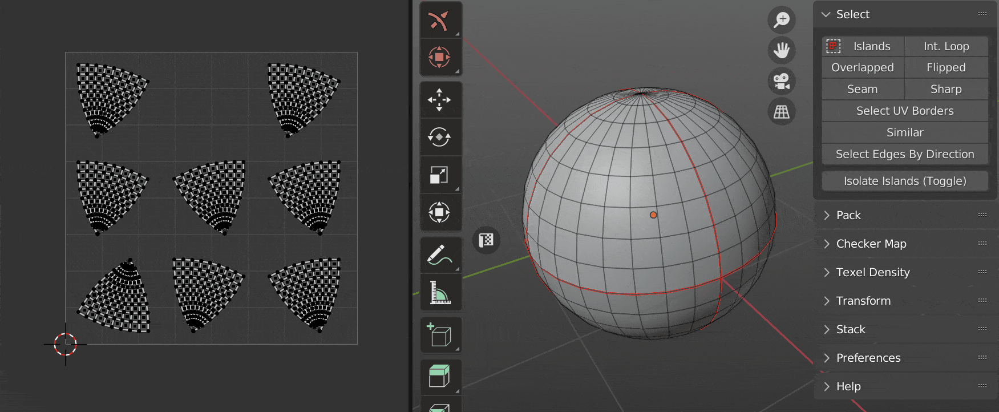

---
### Int. Loop

- Inter seam loop. Select Edge Loop with respect to Seams. 

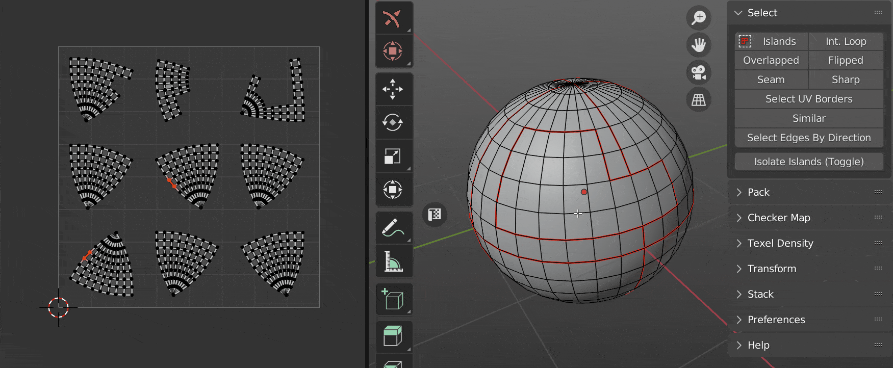

---
### Overlapped

- Select Overlapped Islands.

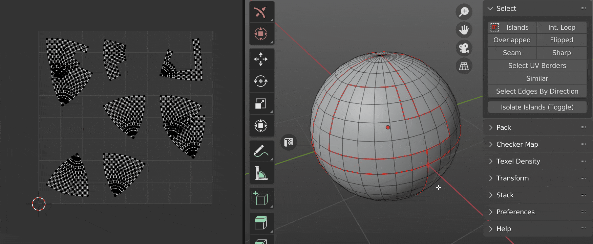

---
### Flipped

- Select Flipped Islands.

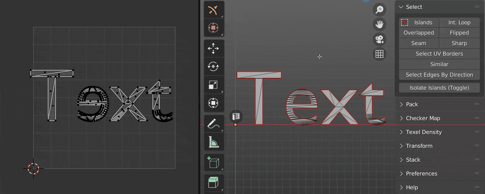

---
### Seam

- Select Edges Marked as Seams.

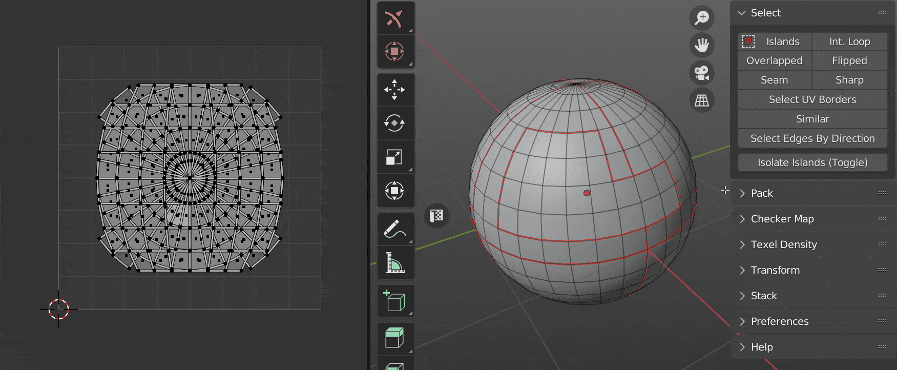

---
### Sharp

- Select Edges Marked as Sharp.

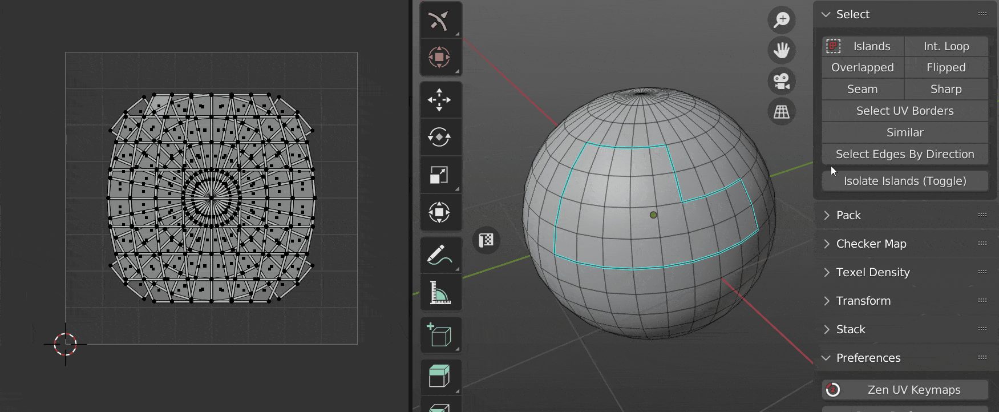

---
### Select UV Borders

- Select existing UV Borders.

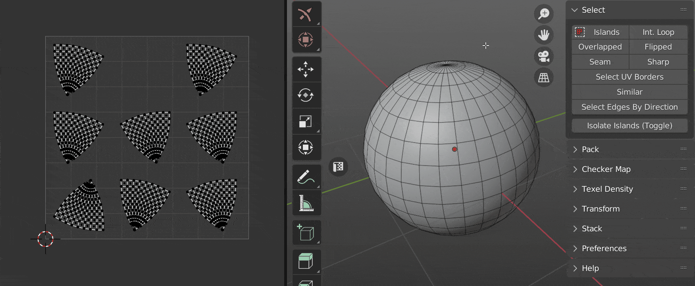

---
### Similar

- Select Islands similar to those selected.

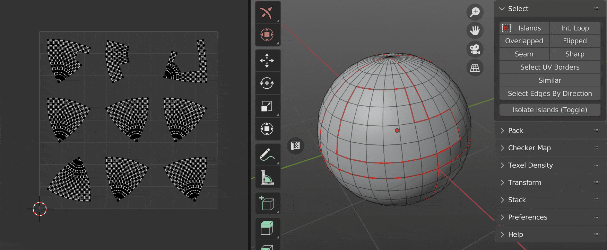
  
---
### Select Edges By Direction

- Select edges by direction along U or V axis.

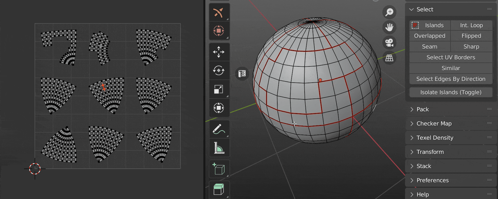

---
### Select by UV Area
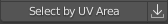

- The operator consists of two buttons. Where the first is the main operator and the second is an auxiliary operator. You can use it to get the area of the selection.

---
#### Operator Select by UV Area:

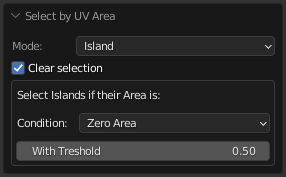

  - **Mode** - What should be selected? Islands or faces.
  - **Clear selection** - Clear the previous selection.
  - **Condition** - The conditions under which the selection will be made.
    - **Zero Area** - Elements with zero area value.
    - **Within range** - Elements, the area of which is within a specified range.
    - **More than** - Elements with an area greater than the specified value.
    - **Equal to** - Elements, the area of which is equal to a specified value.
    - **Less than** - Elements with an area smaller than the specified value.
  - **With Threshold** - Calculation threshold.

#### Operator Get Selected Area:

- After you run this operator, the Multiplied Area value goes into the Select by UV Area operator.

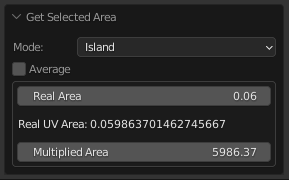

  - **Mode** - The area of what should be obtained? Islands or faces.
  - **Average** - Averaging.
  - **Real Area** - The area within the UV Editor is very small. This value shows the real area.
  - **Real UV Area** - Same value as Real Area, but in full size.
  - **Multiplied Area** - The same value as the Real Area, but multiplied for easier use.

---
### Isolate Islands (Toggle)

- Isolate Islands (Toggle).

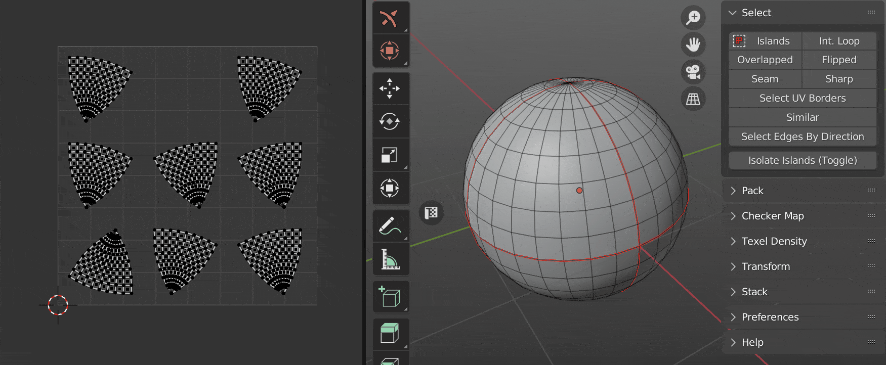
