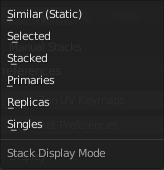
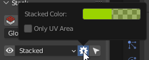

# Stack
!!! Panel
    

## Stack

Collect Similar Islands on Stacks.

!!! Preferences
    

    #### Move Only

    Don't fit Islands. Just move to the same position.

    #### Unstack Direction

    Direction where the island will be shifted.

## Unstack

Shift Islands from Stacks in given direction.

## Stack Mode
Mode for Stacking.

!!! Options

    #### Global Mode

    Collect all Similar Islands on Stacks.

    #### Selected Mode
    
    Collect selected Similar Islands on Stacks.

## Display Stacks 
Display of stacks.
## Select Stacks 
Select stacks.

## Stack Display Mode

!!! Options
    

    - ####  Similar (Static)

    Display all Similar Islands.

    - ####  Selected
    
    Display Similar Islands by Selected.

    - ####  Stacked 

    Display Stacked Islands.
    !!! Options
        

        - ##### Stacked Color
  
        Color for displaying Stacked Islands.

        - ##### Only UV Area
  
        Display Stacks only in UV area

    - #### Primaries 

    Primary Islands. Without Replicated Islands.

    - #### Replicas 

    Islands that can be Stacked. Without Primary Islands.

    - #### Singles 

    Islands that don't have Similar Islands.

---

## Copy

Copy parameters of selected Islands/Faces and save them.

## Paste
Paste the parameters saved earlier to selected Islands/Faces.

---

## Manual Stack

!!! Panel
    

## Area Matching 

Set strict requirements to Islands Area Matching when Stacking. Disable this option if the Islands have a slightly different Area.

## Move Only 

Don't fit Islands. Just move to the same position.

## Add 

Add new Stack.

## Delete 

Delete selected Stack.

## Add Islands 

Append selected Islands to the active Stack.

## Select Islands 

Select Islands in the Stack

## Analyze Stack 

Analyze Islands Similarities in the Stack. You can find details in the Zen UV Manual Stack Analyze document in the Text Editor.

## Remove All 

Remove all Manual Stacks from selected Objects.

## Stack

Collect Islands on Manual Stacks.

## Unstack

Shift Islands from Manual Stacks in given direction.

## Stack Mode
Mode for Stacking.

!!! Options

    #### Global Mode

    Collect all Similar Islands on Stacks.

    #### Selected Mode
    
    Collect selected Similar Islands on Stacks.

## Display Manual Stacks

Display Manual Stacks (Static)

