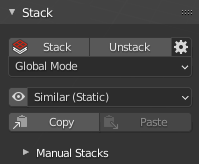
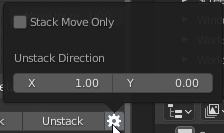
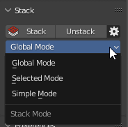
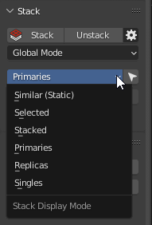
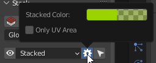
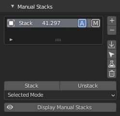

# Stack

!!! Info
    ## ZenUV 3 Support Status

    We would like to inform you that the documentation available on this web page pertains exclusively to Zen UV 3.

    ### ZenUV 3 Support Notice
    Please be advised that active development and technical support for **ZenUV 3** have officially concluded. This version is fully compatible with Blender up to version **5.0**.

    We understand that many of you rely on ZenUV for your professional workflows, and we sincerely apologize for any inconvenience this transition may cause. While we have always strived to provide long-term value, the one-time fixed price paid for ZenUV 3 is no longer sufficient to cover the extensive amount of work required to maintain compatibility with the rapidly changing architecture of newer Blender versions. To ensure the project remains sustainable and continues to meet high standards, we must focus our resources on the next generation of the addon.

    ### Discover [ZenUV 5](https://zenmastersteam.github.io/Zen-UV/latest/)
    To take full advantage of the latest advancements in Blender and UV mapping technology, we strongly recommend upgrading to [**ZenUV 5**](https://superhivemarket.com/products/zen-uv).

!!! Panel
    

## Stack

Collect Similar Islands on Stacks.

!!! Properties
    

    - **Move Only** - Don't fit Islands. Just move to the same position.
    - **Stack Offset** - The offset value. Can be used for preventing auto merging the UV vertices.
    - **Unstack Direction** - The Direction where the island will be shifted.

## Unstack

Shift Islands from Stacks in a given direction.

## Stack Mode
Mode for Stacking.

 

!!! Properties
    - **Global Mode** - Collect all Similar Islands on Stacks.
    - **Selected Mode** - Collect selected Similar Islands on Stacks.
    - **Simple Mode** - Collect selected islands in the stack, with no respect for their topology.

## Stack Display Mode

### Primaries
Primaries this is islands which detected as a better instance. The position and the topology from Primaries will be translated to the Replicas. The island is defined as Primary if its position is closer to the center of coordinates, and the distortion of topology is less compared to other similar islands.

### Replicas

Replicas are islands that have the same topology but were not chosen as Primary. The position and topology of the Replicas will be changed in the process of Stacking.

### Singles

Singles this is islands that have no similar islands.

!!! Options
    

    - **Similar** (Static) - Display all Similar Islands. Static assumes that the displaying will not change along with a mesh change.
    - **Selected** - Display Similar Islands by Selected.

    - **Stacked**  - Display Stacked Islands.

    - **Primaries**  - Primary Islands. Without Replicated Islands.

    - **Replicas**  - Islands that can be Stacked. Without Primary Islands.

    - **Singles**  - Islands that don't have Similar Islands.

    -  **Display**  - Display of stacks.

    -  **Select** - Select Stack Parts. Every operator with this icon perform a selection operation for current types.

!!! Options

    **Options for Stacked Islands**

    

    - **Stacked Color** - Color for displaying Stacked Islands.
    - **Only UV Area** - Display Stacks only in the UV area.

---

## Copy / Paste System

 - **Copy** - Copy parameters of selected Islands/Faces and save them.

 - **Paste** - Paste the parameters saved earlier to selected Islands/Faces.

[Here is full information](operators/stack_copy_paste.md) about Copy / Paste System.

---

## Manual Stack

!!! Panel
    

### Area Matching 

Set strict requirements for Islands Area Matching when Stacking. Disable this option if the Islands have a slightly different Area.

### Move Only 

Don't fit Islands. Just move to the same position.

### Add 

Add new Stack.

### Delete 

Delete selected Stack.

### Add Islands 

Append selected Islands to the active Stack.

### Select Islands 

Select Islands in the Stack

### Analyze Stack 

Analyze Islands Similarities in the Stack. You can find details in the Zen UV Manual Stack Analyze document in the Text Editor.

### Remove All 

Remove all Manual Stacks from selected Objects.

### Stack

Collect Islands on Manual Stacks.

### Unstack

Shift Islands from Manual Stacks in a given direction.

### Stack Mode
Mode for Stacking.

!!! Options

    - **Global Mode** - Collect all Similar Islands on Stacks.
    - **Selected Mode** - Collect selected Similar Islands on Stacks.

### Display Manual Stacks

Display Manual Stacks (Static)
