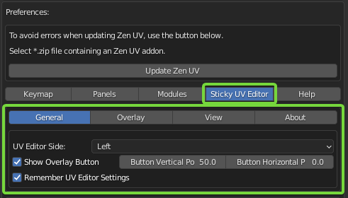

# Sticky UV Editor.

Sticky UV Editor this is a system that allows opening UV Editor on the left or the right from the active 3D Viewport or as a separate window. These actions can be done by shortcuts or using a widget in the 3D Viewport.

The side opening UV Editor depends on the on-screen position of the widget.

## Sticky UV Editor Properties.

The properties of the Sticky UV Editor are placed in the addon preferences.

### General

 - **UV Editor Side** - The side where the UV Editor will be shown.
 - **Show Operate Button** - The visibility of the on-screen widget. Next on the checkbox is the field for the position of the widget.
 - **Remember UV Editor Settings** - Every time UV Editor is opened, all the options activated in the previous session will be remembered and restored to the current session.

### Overlay

The Overlay tab is the copy of the Blender's UV Editor Overlay popup. Once usage of the **Remember UV Editor Settings** is not needed, all the settings from the Overlay tab will be used for every creation of the UV Editor until the user changes the options manually.

### View

The View tab has the same purposes as the **Overlay** tab. Except of controls. It tune the state of the panels in the UV Editor.

### About

The original idea and the development of the Sticky UV Editor belong to Oleg Stepanov (DotBow).
So, here is the [link](https://github.com/DotBow/Blender-Sticky-UV-Editor-Add-on) to the page with an original addon.