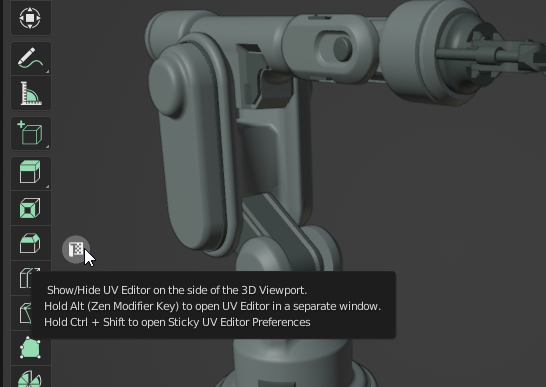
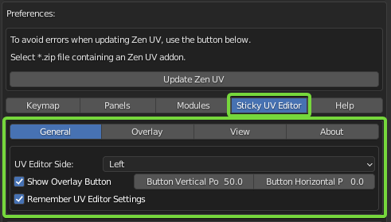

# Sticky UV Editor.

!!! Info
    ## ZenUV 3 Support Status

    We would like to inform you that the documentation available on this web page pertains exclusively to Zen UV 3.

    ### ZenUV 3 Support Notice
    Please be advised that active development and technical support for **ZenUV 3** have officially concluded. This version is fully compatible with Blender up to version **5.0**.

    We understand that many of you rely on ZenUV for your professional workflows, and we sincerely apologize for any inconvenience this transition may cause. While we have always strived to provide long-term value, the one-time fixed price paid for ZenUV 3 is no longer sufficient to cover the extensive amount of work required to maintain compatibility with the rapidly changing architecture of newer Blender versions. To ensure the project remains sustainable and continues to meet high standards, we must focus our resources on the next generation of the addon.

    ### Discover [ZenUV 5](https://zenmastersteam.github.io/Zen-UV/latest/)
    To take full advantage of the latest advancements in Blender and UV mapping technology, we strongly recommend upgrading to [**ZenUV 5**](https://superhivemarket.com/products/zen-uv).

Sticky UV Editor this is a system that allows opening UV Editor on the left or the right from the active 3D Viewport or as a separate window. These actions can be done by shortcuts or using a widget in the 3D Viewport.

The side opening UV Editor depends on the on-screen position of the widget.

## Sticky UV Editor Properties.

The properties of the Sticky UV Editor are placed in the addon preferences.

### General

 - **UV Editor Side** - The side where the UV Editor will be shown.
 - **Show Operate Button** - The visibility of the on-screen widget. Next on the checkbox is the field for the position of the widget.
 - **Remember UV Editor Settings** - Every time UV Editor is opened, all the options activated in the previous session will be remembered and restored to the current session.

### Overlay

The Overlay tab is the copy of the Blender's UV Editor Overlay popup. Once usage of the **Remember UV Editor Settings** is not needed, all the settings from the Overlay tab will be used for every creation of the UV Editor until the user changes the options manually.

### View

The View tab has the same purposes as the **Overlay** tab. Except of controls. It tune the state of the panels in the UV Editor.

### About

The original idea and the development of the Sticky UV Editor belong to Oleg Stepanov (DotBow).
So, here is the [link](https://github.com/DotBow/Blender-Sticky-UV-Editor-Add-on) to the page with an original addon.