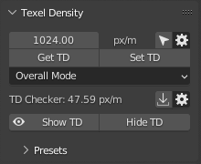
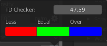
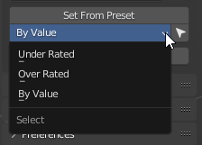

# Texel Density

!!! Info
    We would like to inform you that the documentation available on this web page pertains exclusively to Zen UV 3. However, we would like to emphasize that [**Zen UV 4 is now available and offers a significantly improved user experience**](https://zenmastersteam.github.io/Zen-UV/latest/).

    We also remind that Zen UV 3 users can [**Upgrade Zen UV 3 to Zen UV 4 with a discount!**](https://zenmastersteam.github.io/Zen-UV/latest/zenuv3_to_zenuv4/#upgrade-zen-uv-3-to-zen-uv-4-faq)

!!! Panel
    

!!! Warning
    - Texel Density System uses Vertex Color for displaying some information.
      Make sure viewport shading is switched to **Solid** mode.
  
### Texel Density
- Shows Texel Density value.

!!! Preferences
    

    - **Units** - Texel density calculation units.
    - **Texture Size** - Image Size for Texel Density computation.

### Get TD
  - Get Texel Density from selected Islands.

### Set TD
  - Set Texel Density to selected Islands.

### Set TD Mode
  - Mode for setting Texel Density.

!!! Options

    - **Overall Mode** - Set Texel Density for all selected Islands together.

    - **Island Mode** - Set Texel Density individually for every selected Island.

### TD Checker

  1. Texel Density value used for Show TD operation.
  2. Copy Current TD value to TD Checker value (point 1).

!!! Preferences
    

    - **TD Checker** - Texel Density value used for Show TD operation.

    - **Less** - Viewport display color to represent Texel Density less than TD Checker value.

    - **Equal** - Viewport display color to represent Texel Density equal to TD Checker value.

    - **Over** - Viewport display color to represent Texel Density over than TD Checker value.

### Show TD

  - Display Texel Density in Viewport by chosen TD Checker value and colors.

### Hide TD
  - Disable displaying Texel Density in Viewport by chosen TD Checker value and colors.

---
## Texel Density Presets

### Generate

 - Generate most general Presets.

### Get

 - Get TD from selected Islands to active preset.

### Clear

 - Clear List

### Set From Preset

 - Set TD from active preset to selected Islands.

### Select by TD

 - Select Islands By Texel Density

!!! Options
    - **Under Rated** - Select islands which have TD less than minimal in the list.
    - **Over Rated** - Select islands which have TD bigger than maximal in the list.
    - **By Value** - Select by active preset value.

### Show Presets
 - Turn on Presets Displaying.

### Hide
 - Turn off Presets displaying.

