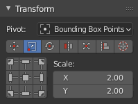

# Transform

## Pivot
Transform Pivot.

---
# Move

Transform type Move.

## Universal Control Panel

The universal control panel that has through logic and different functions for different types of transformation.
In the Transform type Move buttons represents direction of shifting.
## Move Increment
The value on which the island will be shifted.

---
# Scale

Transform type Scale.
## Universal Control Panel
In the Transform type Scale buttons represents Points from where island will be scaled.
## Scale
The value of the scale of the island for each of the axes.

---
# Rotate

Transform type Rotate.
## Universal Control Panel
In the Transform type Scale each button works as described. Buttons located in the corners rotate the island in the specified direction.
The central button performs the automatic aligning of the island horizontally or vertically. The buttons at the top and bottom align the island vertically. Buttons on the left and right align the island horizontally.
## Rotate Increment
The value on which the island will be rotated.
## Orient by selected
Reoriented the island by selected elements (vertices, edges, polygons).

---
# Flip

Transform type Flip.
## Universal Control Panel
In the Transform type Flip buttons represents flip direction.

---
# Fit

Transform type Fit.

Fit island to UV Square.
## Universal Control Panel
In the Transform type Fit buttons represents origins from where Fit will be performed.
## Fill Islands
Fit Islands from Center without keeping proportions.
## Padding
Clearance between island and UV Square bounds.
## Bounds
It makes it possible to fill out not UV Square but any other area.

---
# Align

Transform type Align.
## Universal Control Panel
In the Transform type Align buttons represent the side by which the islands will be aligned.

---
# 2D Cursor

Transform type 2D Cursor.

Align 2D Cursor over the selected island.
## Universal Control Panel
In the Transform type 2D Cursor buttons represent sides of the island or selected elements.