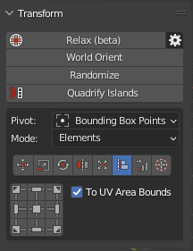
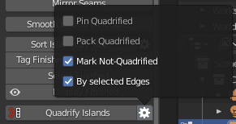
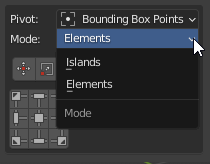
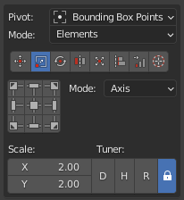
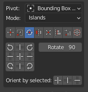
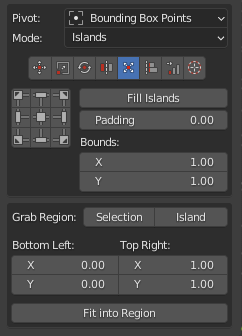
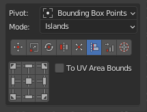

# Transform System

!!! Panel
    

---
## Independent Transform Operators:
---
### Relax 
---
### World Orient
---
### Randomize
---
### Quadrify Islands 

Straighten rectangular-shaped Islands.

!!! Preferences

    - **Pin Quadrified** - Pin Islands after Quadrify Islands operation.

    - **Pack Quadrified** - Pin Islands after Quadrify Islands operation.

    - **Mark Not-Quadrified** - Mark faces boundaries of Not-Quadrified parts as Seams after Quadrify Islands operation.

    - **By selected Edges** - Selected Edges will be used and marked as Seams during Quadrify Islands operation. Works only in edge selection mode.

---
## Unified Transform System:
!!! Panel
    

!!! Control
    **Universal Control Panel**

    

    The universal control panel has logic and different functions for different types of transformation.

---
#### Pivot.

 - The pivot of transformation.

#### Mode.

 - The Mode of transformation. In the Elements mode transformation will be performed over vertices, edges, and faces.

---
## Transform Types:

### Transform type Move. 

!!! Info
    - Buttons of the **Universal Control Panel** in the Transform type **Move** represent the direction of shifting.

#### Move Increment
 - The value on which the island will be shifted.

---
### Transform type Scale. 

!!! Info
    - Buttons of the **Universal Control Panel** in the Transform type **Scale** represent Points from where the island will be scaled.

#### Scale Mode:

#### Mode - **Axis**.

 - **Scale** - The value of the scale of the island for each of the axes.
 - **Tuner** - System that helps change values quickly.
     - "D" - Increase by two times.
     - "H" - Decrease two times.
     - "R" - Reset value to 1.0 .
     - Lock. - The Lock mode allows changing values as one.

#### Mode - **Units**.

 - **UV Size** - The estimated width of the UV area.
 - **Desired size** - The size of which should be set for selected elements relative to UV area.
 - **G** - Grab desired size from current selection. Exist only in the 3D Viewort context. Can be used only for 2 vertices or for one edge selection.
 - **Horizontal / Vertical** - What mean the Desired Size.

---
### Transform type Rotate. 

!!! Info
    - Buttons of the **Universal Control Panel** in the Transform type **Scale** works as described. Buttons located in the corners rotate the island in the specified direction.
    The central button performs the automatic aligning of the island horizontally or vertically. The buttons at the top and bottom align the island vertically. Buttons on the left and right align the island horizontally.

#### Rotate Increment
 - The value on which the island will be rotated.
#### Orient by selected
 - Reorient the island by selected elements (vertices, edges, polygons).

---
### Transform type Flip. 

!!! Info
    - Buttons of the **Universal Control Panel** in the Transform type **Flip** represent flip direction.

---
### Transform type Fit. 

Fit island to UV Square.

!!! Info
    - Buttons of the **Universal Control Panel** in the Transform type **Fit** represent origins from where **Fit** will be performed.

#### Fill Islands

 - Fit Islands from Center without keeping proportions.

#### Padding

 - Clearance between island and UV Square bounds.

#### Bounds

 - It makes it possible to fill out not UV Square but any other area.

### Fit into Region.

 - **Grab Region: Selection / Island** - Allow to grab Region size in different manners.
 - **Bottom Left: Top Right:** - The bounding box of the region.
 - **Fit into Region** - Fit selected island in to the Region described in the bounding box.

---
## Transform type Align. 

!!! Info
    - Buttons of the **Universal Control Panel** in the Transform type **Align** represent the side by which the islands will be aligned.

### To UV Area Bounds
 - Allow aligning current selection to the UV Area bounds.

---
# Transform type 2D Cursor. 

Align 2D Cursor over the selected island.

!!! Info
    - Buttons of the **Universal Control Panel** in the Transform type **2D Cursor** represent sides of the island or selected elements.

