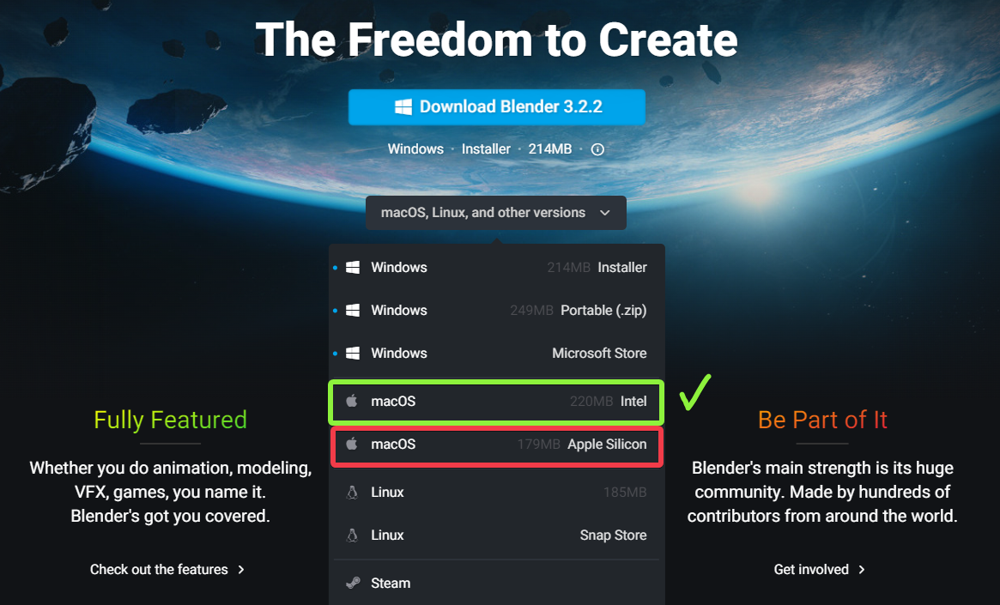

# FAQs
----
### Can I unwrap organic models using Zen UV?
— Yes, among other tools Zen UV has [**Relax**](https://zen-masters.github.io/Zen-UV/transform/#relax) operator that is well suited for relaxing UV Islands of organic 3D models.

----
### Can I use Zen UV on my Mac M1, M2?
— Yes, if you use ___Blender (Universal app)___. For ___Blender (Silicon app)___ there are some limitations, [**Stack**](https://zen-masters.github.io/Zen-UV/stack/) and [**Relax**](https://zen-masters.github.io/Zen-UV/transform/#relax) features won't work due to specific libraries. Unfortunately, we're not going to develop separate libraries for ___Blender (Silicon app)___.

<!-- blank line -->
----
### I can't Install or Update Zen UV.
— Please visit this page [**Installation and update**](https://zen-masters.github.io/Zen-UV/installation/).
<!-- blank line -->
----
### How can I change default Zen UV shortcuts?
— Go to **Edit** -> **Preferences** -> **Add-ons** -> **Zen UV** -> **Keymap**.
<!-- blank line -->
----
### I can't find the Zen UV panel in the N-panel.
— Zen UV panel is only present in **Edit Mode.**
<!-- blank line -->
----
<!-- blank line -->
If you have any questions, please let us know:
 [**Discord**](https://discord.gg/wGpFeME)