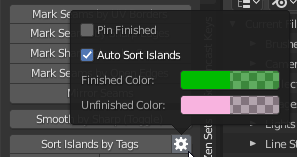

# Unwrap

## Zen Unwrap 

Mark selected edges/faces as Seams and/or Sharp edges and Unwrap by Marked edges after

!!! Preferences

    #### Mark Unwrapped

    Mark edges or face borders as Seams and/or Sharp edges after Zen Unwrap operation

    #### Unwrap Selected Only

    Separate workflow where only Selected Faces will be Unwrapped. It includes warnings and Unwrapping options if nothing is selected.

    #### Tag Unwrapped

    Tag Unwrapped Islands as Finished after Zen Unwrap operation.

    #### Sort Unwrapped

    Sort Islands by Tags after Zen Unwrap operation. Finished Islands move to the right side from Main UV Tile, Unfinished — to the left.

    #### Auto UV Sync

    Automatically Activate UV Sync Selection Mode in UV Editor for Zen Unwrap operation.

    #### Pack Unwrapped

    Execute Pack after Zen Unwrap operation.

    #### Unwrap Method
    - Conformal
    - Angle Based

---
## Mark by Angle

Mark edges as Seams and/or Sharp edges by Angle.

## Mark 

Mark selected edges or face borders as Seams and/or Sharp edges.

## Unmark 

Unmark selected edges or face borders as Seams and/or Sharp edges.

## Unmark All

Remove all the Seams and/or Sharp edges from the mesh.

---
## Mark Seams by UV Borders
Mark Seams by existing UV Borders.

## Mark Seams by Sharp Edges
Mark Seams by existing Sharp edges.

## Mark Sharp Edges by Seams
Mark Sharp edges by existing Seams.

## Mirror Seams
Mirror Seams by axes.

## Mark Seams by Open Edges
Mark Seams by Open Edges. Way that looks in the viewport.

---
## Smooth by Sharp (Toggle)
Toggle between Auto Smooth 180° (with sharp edges) and regular smooth modes.

---
## Sort Islands by Tags
Sort Islands by Tags. Finished Islands move to the right side from Main UV Tile, Unfinished — to the left.

!!! Preferences
    #### Pin Finished
    Pin Islands after Tag Finished operation.
    #### Auto Sort Islands
    Automatically Sort Islands by Tags. Finished Islands move to the right side from Main UV Tile, Unfinished — to the left
    #### Finished Color
    Finished Islands viewport display color.
    #### Unfinished Color
    Unfinished Islands viewport display color.

## Tag Finished

Tag Islands as Finished.

## Tag Unfinished

Tag Islands as Unfinished.

## Select Finished

Select Islands tagged as Finished.

## Display Finished (Toggle)

Display Finished/Unfinished Islands in viewport

---
## Quadrify Islands 

Straighten rectangular shaped Islands

!!! Preferences

    #### Pin Quadrified

    Pin Islands after Quadrify Islands operation.

    #### Pack Quadrified

    Pin Islands after Quadrify Islands operation.

    #### Mark Not-Quadrified

    Mark face boundaries of Not-Quadrified parts as Seams after Quadrify Islands operation.

    #### By selected Edges

    Selected Edges will be used and marked as Seams during Quadrify Islands operation. Works only in edge selection mode.

