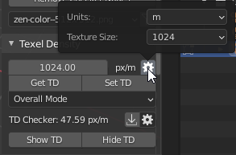

# Texel Density
!!! Panel
    
## Texel Density
Shows Texel Density value.

!!! Preferences
    
    #### Units

    Texel density calculation units.

    #### Texture Size

    Image Size for Texel Density computation.

## Get TD
Get Texel Density from selected Islands.

## Set TD
Set Texel Density to selected Islands.

## Set TD Mode
Mode for setting Texel Density.

!!! Options

    #### Overall Mode

    Set Texel Density for all selected Islands together.

    #### Island Mode
    
    Set Texel Density individually for every selected Island.

## TD Checker
Texel Density value used for Show TD operation.

!!! Preferences
    

    #### TD Checker

    Texel Density value used for Show TD operation.

    #### Less

    Viewport display color to represent Texel Density less than TD Checker value.

    #### Equal

    Viewport display color to represent Texel Density equal to TD Checker value.

    #### Over

    Viewport display color to represent Texel Density over than TD Checker value.

## Show TD
Display Texel Density in Viewport by chosen TD Checker value and colors.

## Hide TD
Disable displaying Texel Density in Viewport by chosen TD Checker value and colors.

