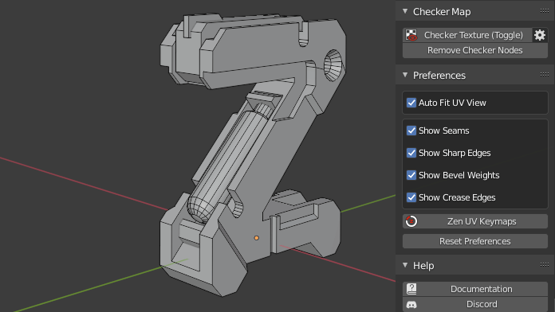

# Preferences

## Auto Fit UV View

Automatically Fit and Zoom UV viewport.

## Show Seams

Display UV Seams.

## Show Sharp Edges

Display Sharp edges. It can be overlapped by Seams/Bevel Weights/Crease Edges display.

## Show Bevel Weights

Display Sharp edges. It can be overlapped by Seams/Bevel Weights/Crease Edges display.

## Show Crease Edges

Display crease edges created for the Subdivision modifier. It can be overlapped by Seams/Bevel Weights display.

## Zen UV Keymaps 

Set Shortcuts for Zen UV Menus.

## Reset Preferences

Reset Zen UV preferences to Default state.