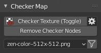

# Checker Map

!!! Panel

## Checker Texture (Toggle) 

Add Checker Texture to the mesh (Toggle).

!!! Preferences
    

    #### Checker Library Folder
    Checker Library Folder indicates the folder with 
    which Zen UV Checker will work.
        All textures in * .JPG, * .PNG formats that are 
        inside this folder will be collected in 
        Checker Textures list and can be used to display 
        on selected models.
    #### Reset Folder
    Reset Checker Library path to Default State.
    #### Load Your Texture
    Open File Browser and add the selected texture to the Checker Library.
    #### Refresh Texture Library
    Refresh Textures from Checker Library Folder.
    #### Auto Sync Checker
    Automatically sync selected Checker Texture with Viewport.
    #### Open Shader Editor
    Open Shader Editor with Zen UV Checker Node.
    #### Reset Checker
    Reset Zen UV Checker to Default state.

## Remove Checker Nodes
Remove Zen UV Checker Nodes from the scene materials.

## Checker Textures
The Checker Textures field is used to select the checker texture that will be displayed on the selected models.

## Filter 
Enable resolution fields to filter existing textures by X or/and Y resolutions.
It includes a Lock button for filtering square format textures.