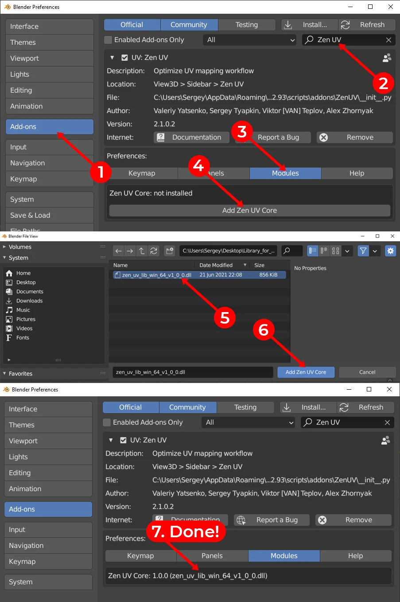

# Installation

## Zen UV

To install addon go to **Preferences --- Addons --- Install**, then you can enable addon by clicking on the checkbox.

Also, you can [**watch the video**](https://youtu.be/dqpgWcRBE4o?t=17) how to install it.

## Zen UV - Core Library

This is an additional library of the Zen UV add-on to get the fastest computations (Stack algorithm) in C++ which is impossible to be implemented in Python. It is distributed separately from the add-on as it is licensed differently from the GPL (Apache License 2.0). Zen UV Core library does not collect or send any data. It does not use any network connections: either internet or local. (Supported on Windows, Mac OS, and Linux platforms.)

### Installation

1. Be sure that Zen UV add-on is already installed.
2. Go to Edit -> Preferences -> Add-ons -> Zen UV
3. Go to Modules
4. Press  Add Zen UV Core
5. Select zen_uv_lib file in the File View Window. 
6. Press  Add Zen UV Core
7. Done!

