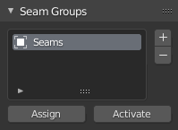

# Seam Groups
!!! Panel
    

## Add 
Add a new Seam Group to the list.
## Delete 
Delete the selected Seam Group from the list.

## Assign
Assign Seams to selected Seam Group.
## Activate
Set Seams from selected Seam Group to selected mesh.